# System Architecture
## AI-Powered Invoice Audit & Risk Screening Platform

**Version**: 1.0  
**Date**: August 1, 2026  
**Status**: Design Document

---

## Table of Contents
1. [High-Level Architecture](#high-level-architecture)
2. [Component Architecture](#component-architecture)
3. [Data Flow](#data-flow)
4. [AI Pipeline](#ai-pipeline)
5. [Backend Architecture](#backend-architecture)
6. [Frontend Architecture](#frontend-architecture)
7. [Sequence Diagrams](#sequence-diagrams)
8. [Folder Structure](#folder-structure)
9. [Deployment Architecture](#deployment-architecture)
10. [Technology Stack](#technology-stack)

---

## High-Level Architecture

### System Overview

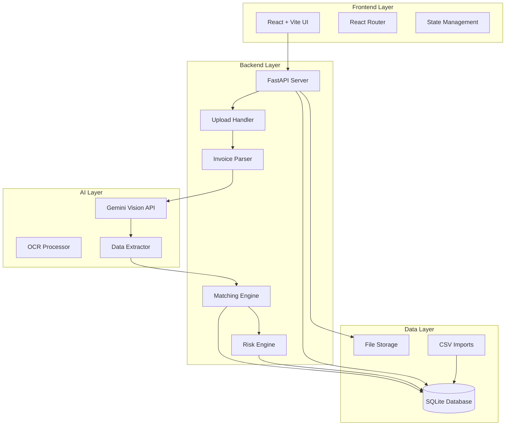


### Architecture Layers

**Presentation Layer**
- React-based Single Page Application (SPA)
- Responsive UI with Tailwind CSS
- Component library (shadcn/ui)
- Client-side routing (React Router)
- State management for global data

**Application Layer**
- RESTful API built with FastAPI
- Business logic modules (matching, risk scoring)
- File upload handling
- Request validation and error handling
- API documentation (Swagger/OpenAPI)

**AI/ML Layer**
- Gemini Vision API integration
- OCR and text extraction
- Structured JSON output
- Confidence scoring
- Image preprocessing (optional)

**Data Layer**
- SQLite database for structured data
- Local file system for uploaded files
- CSV import for master data
- Audit trail logging

**Integration Layer**
- External API calls (Gemini)
- File system operations
- Database transactions
- Error handling and retries

---

## Component Architecture

### Component Diagram

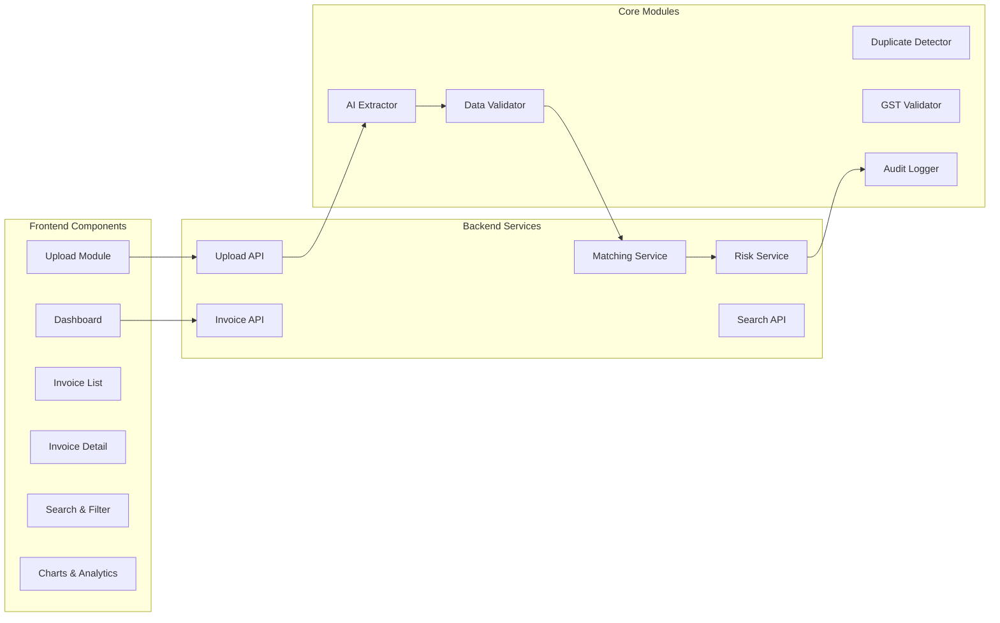


### Core Components Description

**Frontend Components**
- **Dashboard**: Summary cards, charts, recent invoices
- **Upload Module**: File picker, drag-drop, progress tracking
- **Invoice List**: Table view, search, filters, pagination
- **Invoice Detail**: Full invoice view, extracted data, risk analysis
- **Search & Filter**: Advanced filtering, sorting
- **Charts & Analytics**: Risk distribution, vendor stats, trends

**Backend Services**
- **Upload API**: File handling, validation, storage
- **Invoice API**: CRUD operations, queries
- **Matching Service**: Ledger matching, vendor verification
- **Risk Service**: Risk rule evaluation, scoring
- **Search API**: Full-text search, filtering

**Core Modules**
- **AI Extractor**: Gemini API integration, OCR
- **Data Validator**: Field validation, type checking
- **Duplicate Detector**: Invoice comparison, similarity
- **GST Validator**: Format checking, validation
- **Audit Logger**: Immutable logging, tracking

---

## Data Flow

### End-to-End Invoice Processing Flow

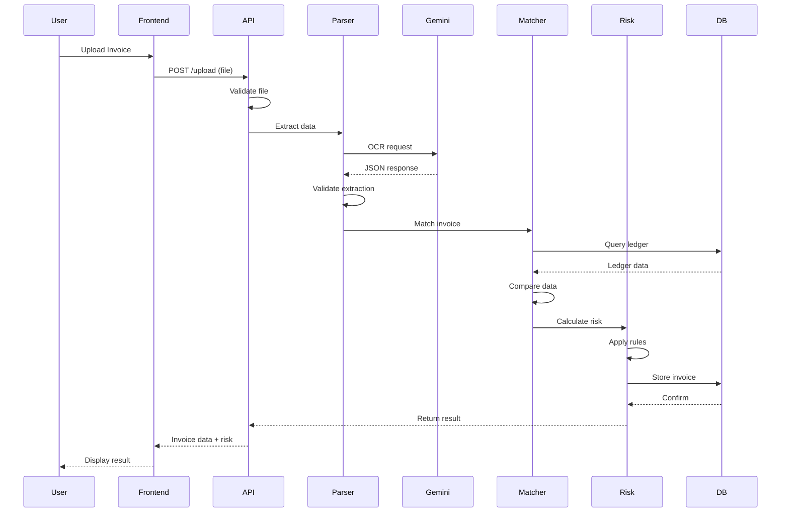


### Upload Pipeline

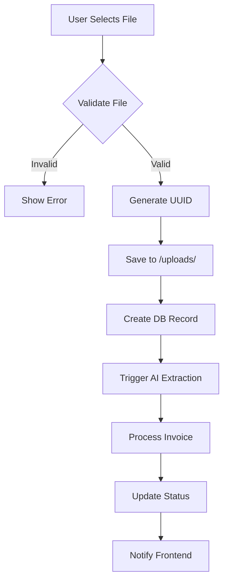

### Invoice Processing Workflow

```mermaid
flowchart LR
    subgraph "Stage 1: Upload"
        Upload[Upload File] --> Validate[Validate Format]
        Validate --> Store[Store File]
    end
    
    subgraph "Stage 2: Extraction"
        Store --> AI[AI Extraction]
        AI --> Parse[Parse JSON]
        Parse --> ValidateData[Validate Data]
    end
    
    subgraph "Stage 3: Matching"
        ValidateData --> LedgerMatch[Match Ledger]
        LedgerMatch --> VendorMatch[Match Vendor]
        VendorMatch --> DupeCheck[Duplicate Check]
    end
    
    subgraph "Stage 4: Risk"
        DupeCheck --> RiskRules[Apply Risk Rules]
        RiskRules --> CalcScore[Calculate Score]
        CalcScore --> SaveDB[Save to DB]
    end
    
    SaveDB --> Complete[Complete]
```

---

## AI Pipeline

### Gemini Vision API Integration

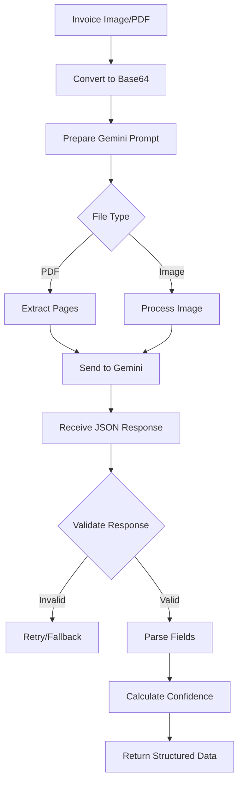

### AI Extraction Process

**Input**: Invoice file (PDF/JPEG/PNG)

**Processing Steps**:
1. File preprocessing (resize, compress if needed)
2. Convert to base64 encoding
3. Construct structured prompt with expected JSON schema
4. Call Gemini Vision API
5. Parse response
6. Validate extracted fields
7. Calculate confidence scores
8. Store raw response for debugging

**Output**: Structured JSON with fields + confidence scores

**Schema Example**:
```json
{
  "invoice_number": "INV-2024-001",
  "vendor_name": "ABC Supplies Ltd",
  "vendor_gst": "29ABCDE1234F1Z5",
  "invoice_date": "2024-07-15",
  "due_date": "2024-08-15",
  "subtotal": 50000.00,
  "tax_amount": 9000.00,
  "total_amount": 59000.00,
  "currency": "INR",
  "line_items": [...],
  "confidence_scores": {...}
}
```


---

## Backend Architecture

### FastAPI Application Structure

```
backend/
├── app/
│   ├── main.py              # FastAPI app initialization
│   ├── config.py            # Configuration & env vars
│   ├── database.py          # SQLite connection
│   │
│   ├── api/                 # API routes
│   │   ├── __init__.py
│   │   ├── upload.py        # Upload endpoints
│   │   ├── invoices.py      # Invoice CRUD
│   │   ├── dashboard.py     # Dashboard stats
│   │   ├── search.py        # Search & filter
│   │   └── audit.py         # Audit trail
│   │
│   ├── models/              # Database models
│   │   ├── __init__.py
│   │   ├── invoice.py
│   │   ├── ledger.py
│   │   ├── vendor.py
│   │   ├── exception.py
│   │   ├── risk_report.py
│   │   └── audit_trail.py
│   │
│   ├── schemas/             # Pydantic schemas
│   │   ├── __init__.py
│   │   ├── invoice.py
│   │   ├── risk.py
│   │   └── response.py
│   │
│   ├── services/            # Business logic
│   │   ├── __init__.py
│   │   ├── ai_extractor.py
│   │   ├── matching_engine.py
│   │   ├── risk_engine.py
│   │   ├── duplicate_detector.py
│   │   ├── gst_validator.py
│   │   └── audit_logger.py
│   │
│   ├── utils/               # Utilities
│   │   ├── __init__.py
│   │   ├── file_handler.py
│   │   ├── validators.py
│   │   └── helpers.py
│   │
│   └── tests/               # Test suite
│       ├── __init__.py
│       ├── test_api.py
│       └── test_services.py
│
├── uploads/                 # Uploaded files
├── data/                    # CSV imports
├── requirements.txt
├── Dockerfile
└── README.md
```

### Backend Flow Diagram

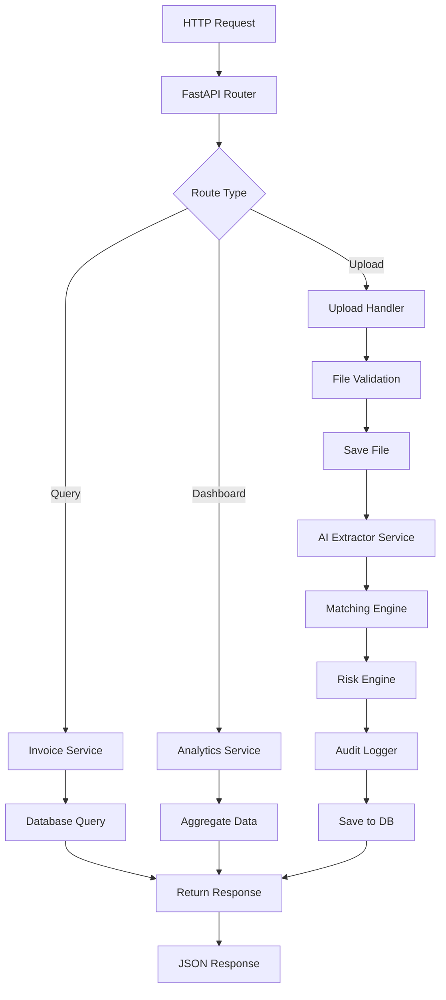


---

## Frontend Architecture

### React Application Structure

```
frontend/
├── src/
│   ├── main.tsx             # App entry point
│   ├── App.tsx              # Root component
│   ├── index.css            # Global styles
│   │
│   ├── components/          # Reusable components
│   │   ├── ui/              # shadcn components
│   │   │   ├── button.tsx
│   │   │   ├── card.tsx
│   │   │   ├── table.tsx
│   │   │   ├── dialog.tsx
│   │   │   └── ...
│   │   │
│   │   ├── layout/
│   │   │   ├── Header.tsx
│   │   │   ├── Sidebar.tsx
│   │   │   ├── Footer.tsx
│   │   │   └── Layout.tsx
│   │   │
│   │   ├── dashboard/
│   │   │   ├── SummaryCards.tsx
│   │   │   ├── RiskChart.tsx
│   │   │   ├── RecentInvoices.tsx
│   │   │   └── ExceptionAlerts.tsx
│   │   │
│   │   ├── invoice/
│   │   │   ├── InvoiceCard.tsx
│   │   │   ├── InvoiceTable.tsx
│   │   │   ├── InvoiceDetail.tsx
│   │   │   └── RiskBadge.tsx
│   │   │
│   │   └── upload/
│   │       ├── DropZone.tsx
│   │       ├── UploadProgress.tsx
│   │       └── FilePreview.tsx
│   │
│   ├── pages/               # Page components
│   │   ├── Dashboard.tsx
│   │   ├── Upload.tsx
│   │   ├── InvoiceList.tsx
│   │   ├── InvoiceDetails.tsx
│   │   ├── Search.tsx
│   │   ├── AuditTrail.tsx
│   │   └── Settings.tsx
│   │
│   ├── hooks/               # Custom hooks
│   │   ├── useInvoices.ts
│   │   ├── useUpload.ts
│   │   ├── useSearch.ts
│   │   └── useAuth.ts
│   │
│   ├── services/            # API services
│   │   ├── api.ts           # Axios instance
│   │   ├── invoiceService.ts
│   │   ├── uploadService.ts
│   │   └── dashboardService.ts
│   │
│   ├── types/               # TypeScript types
│   │   ├── invoice.ts
│   │   ├── risk.ts
│   │   └── api.ts
│   │
│   ├── utils/               # Utilities
│   │   ├── formatters.ts
│   │   ├── validators.ts
│   │   └── constants.ts
│   │
│   └── lib/                 # Config
│       └── utils.ts         # shadcn utils
│
├── public/                  # Static assets
├── index.html
├── package.json
├── tsconfig.json
├── vite.config.ts
└── tailwind.config.ts
```

### Frontend Component Tree

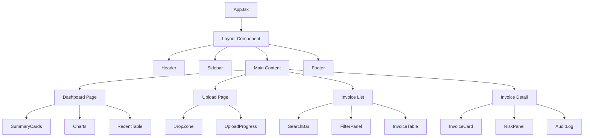


---

## Sequence Diagrams

### Upload & Process Invoice Sequence

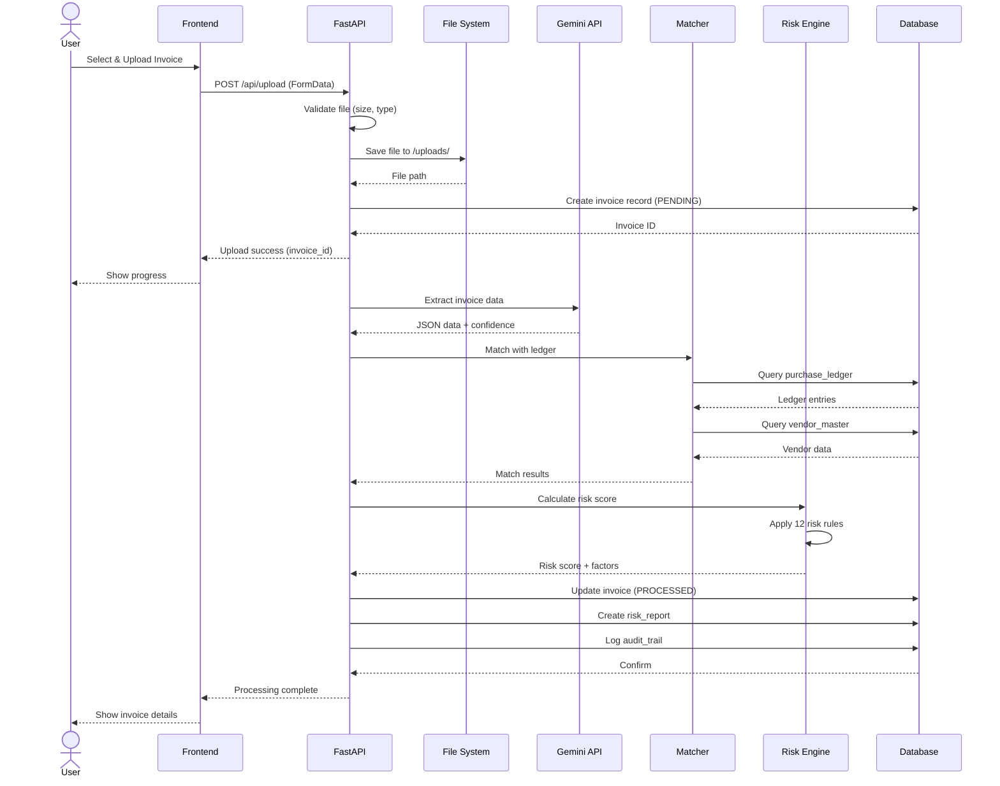

### Dashboard Data Fetch Sequence

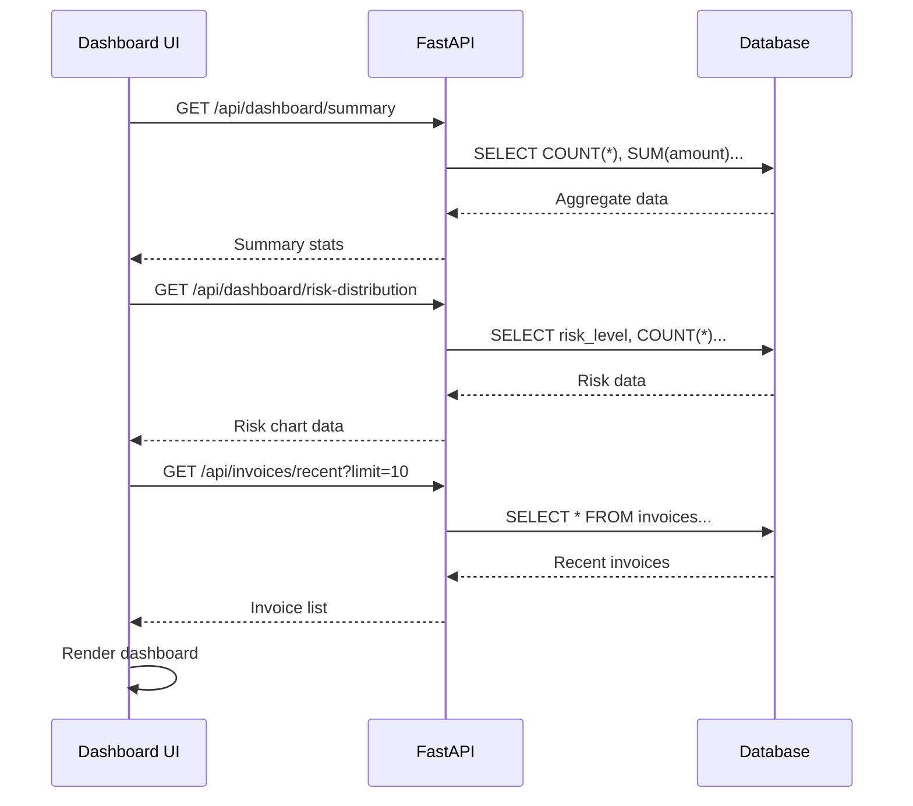

### Search & Filter Sequence

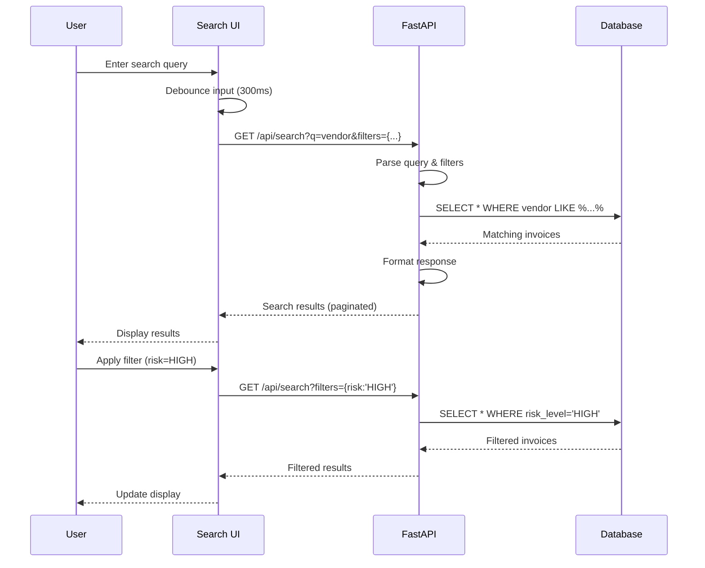


---

## Folder Structure

### Complete Project Structure

```
invoice-audit-platform/
│
├── backend/
│   ├── app/
│   │   ├── __init__.py
│   │   ├── main.py
│   │   ├── config.py
│   │   ├── database.py
│   │   │
│   │   ├── api/
│   │   │   ├── __init__.py
│   │   │   ├── upload.py
│   │   │   ├── invoices.py
│   │   │   ├── dashboard.py
│   │   │   ├── search.py
│   │   │   └── audit.py
│   │   │
│   │   ├── models/
│   │   │   ├── __init__.py
│   │   │   ├── invoice.py
│   │   │   ├── ledger.py
│   │   │   ├── vendor.py
│   │   │   ├── exception.py
│   │   │   ├── risk_report.py
│   │   │   └── audit_trail.py
│   │   │
│   │   ├── schemas/
│   │   │   ├── __init__.py
│   │   │   ├── invoice.py
│   │   │   ├── risk.py
│   │   │   └── response.py
│   │   │
│   │   ├── services/
│   │   │   ├── __init__.py
│   │   │   ├── ai_extractor.py
│   │   │   ├── matching_engine.py
│   │   │   ├── risk_engine.py
│   │   │   ├── duplicate_detector.py
│   │   │   ├── gst_validator.py
│   │   │   └── audit_logger.py
│   │   │
│   │   ├── utils/
│   │   │   ├── __init__.py
│   │   │   ├── file_handler.py
│   │   │   ├── validators.py
│   │   │   └── helpers.py
│   │   │
│   │   └── tests/
│   │       ├── __init__.py
│   │       ├── test_api.py
│   │       ├── test_services.py
│   │       └── test_models.py
│   │
│   ├── uploads/               # Invoice files
│   ├── data/                  # CSV imports
│   │   ├── purchase_ledger.csv
│   │   ├── vendor_master.csv
│   │   └── sample_invoices/
│   │
│   ├── database.db            # SQLite database
│   ├── requirements.txt
│   ├── Dockerfile
│   ├── .env.example
│   └── README.md
│
├── frontend/
│   ├── src/
│   │   ├── main.tsx
│   │   ├── App.tsx
│   │   ├── index.css
│   │   │
│   │   ├── components/
│   │   │   ├── ui/            # shadcn components
│   │   │   ├── layout/
│   │   │   ├── dashboard/
│   │   │   ├── invoice/
│   │   │   └── upload/
│   │   │
│   │   ├── pages/
│   │   │   ├── Dashboard.tsx
│   │   │   ├── Upload.tsx
│   │   │   ├── InvoiceList.tsx
│   │   │   ├── InvoiceDetails.tsx
│   │   │   └── AuditTrail.tsx
│   │   │
│   │   ├── hooks/
│   │   ├── services/
│   │   ├── types/
│   │   ├── utils/
│   │   └── lib/
│   │
│   ├── public/
│   ├── index.html
│   ├── package.json
│   ├── tsconfig.json
│   ├── vite.config.ts
│   ├── tailwind.config.ts
│   ├── Dockerfile
│   └── README.md
│
├── docs/
│   ├── PRD.md
│   ├── Architecture.md
│   ├── Database.md
│   ├── API.md
│   ├── Modules.md
│   ├── Routes.md
│   ├── UI.md
│   ├── Design.md
│   ├── Navigation.md
│   ├── Roadmap.md
│   └── TODO.md
│
├── docker-compose.yml
├── .gitignore
└── README.md
```


---

## Deployment Architecture

### Local Development Setup

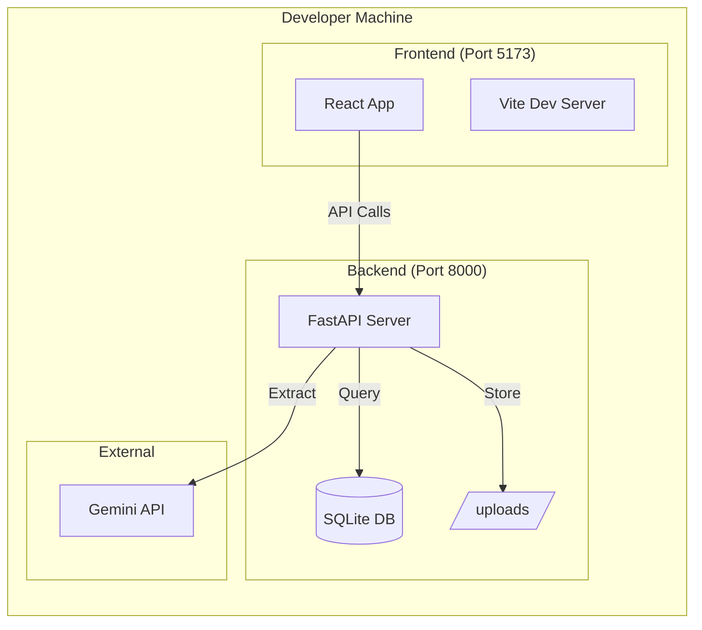

### Docker Deployment

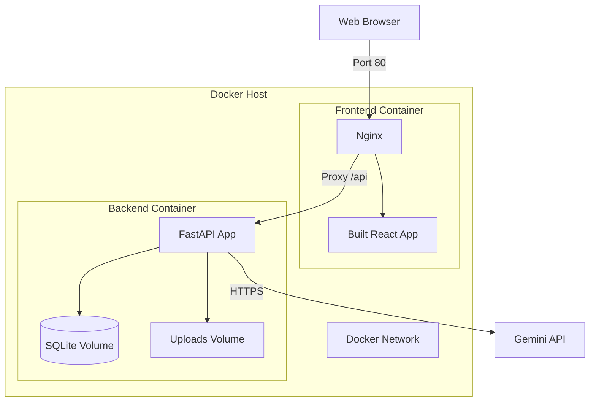

### Docker Compose Configuration

```yaml
# docker-compose.yml
version: '3.8'

services:
  backend:
    build: ./backend
    container_name: invoice-backend
    ports:
      - "8000:8000"
    volumes:
      - ./backend/uploads:/app/uploads
      - ./backend/data:/app/data
      - ./backend/database.db:/app/database.db
    environment:
      - GEMINI_API_KEY=${GEMINI_API_KEY}
      - DATABASE_URL=sqlite:///./database.db
      - UPLOAD_DIR=/app/uploads
    networks:
      - invoice-network
    restart: unless-stopped

  frontend:
    build: ./frontend
    container_name: invoice-frontend
    ports:
      - "80:80"
    depends_on:
      - backend
    environment:
      - VITE_API_URL=http://backend:8000
    networks:
      - invoice-network
    restart: unless-stopped

networks:
  invoice-network:
    driver: bridge

volumes:
  uploads:
  database:
```

### Production Deployment (Cloud)

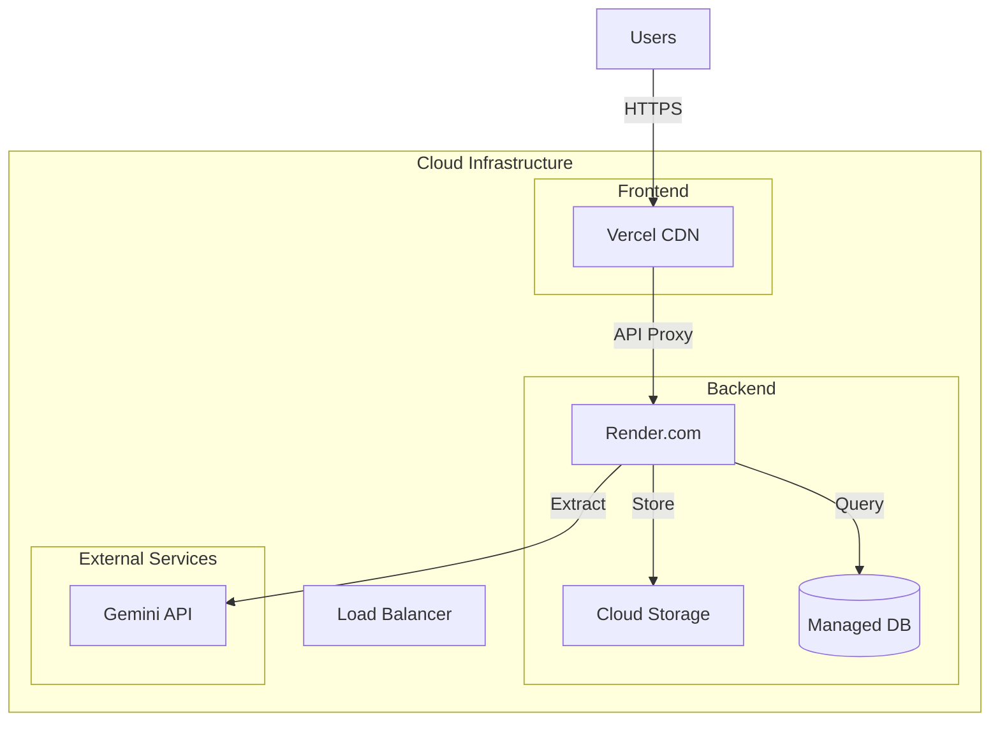


---

## Technology Stack

### Frontend Technologies

| Technology | Version | Purpose |
|------------|---------|---------|
| **React** | 18.2+ | UI library |
| **TypeScript** | 5.0+ | Type safety |
| **Vite** | 4.4+ | Build tool & dev server |
| **React Router** | 6.14+ | Client-side routing |
| **Tailwind CSS** | 3.3+ | Utility-first styling |
| **shadcn/ui** | Latest | Component library |
| **Recharts** | 2.7+ | Data visualization |
| **Framer Motion** | 10.12+ | Animations |
| **Axios** | 1.4+ | HTTP client |
| **React Hook Form** | 7.45+ | Form handling |
| **Zod** | 3.21+ | Schema validation |
| **date-fns** | 2.30+ | Date utilities |

### Backend Technologies

| Technology | Version | Purpose |
|------------|---------|---------|
| **Python** | 3.10+ | Programming language |
| **FastAPI** | 0.100+ | Web framework |
| **Pydantic** | 2.0+ | Data validation |
| **SQLite** | 3.40+ | Database |
| **SQLAlchemy** | 2.0+ | ORM |
| **pandas** | 2.0+ | Data processing |
| **pdfplumber** | 0.9+ | PDF parsing |
| **Pillow** | 10.0+ | Image processing |
| **opencv-python** | 4.8+ | Image preprocessing |
| **python-multipart** | 0.0.6+ | File upload handling |
| **uvicorn** | 0.23+ | ASGI server |

### AI & ML

| Technology | Version | Purpose |
|------------|---------|---------|
| **Google Gemini** | 1.5 Pro | Vision & OCR |
| **google-generativeai** | 0.3+ | Python SDK |

### DevOps & Deployment

| Technology | Purpose |
|------------|---------|
| **Docker** | Containerization |
| **Docker Compose** | Multi-container orchestration |
| **Vercel** | Frontend hosting |
| **Render** | Backend hosting |
| **GitHub Actions** | CI/CD |

---

## Security Architecture

### Security Layers

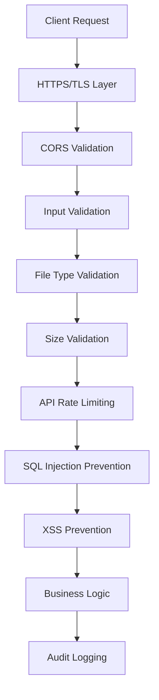

### Security Measures

**File Upload Security**
- File type validation (whitelist: PDF, JPEG, PNG)
- File size limit (10MB max)
- Virus scanning (future)
- Secure file storage with UUID names
- No executable files allowed

**API Security**
- CORS configuration
- Rate limiting (100 req/min)
- Input validation (Pydantic)
- SQL injection prevention (SQLAlchemy ORM)
- XSS prevention (output encoding)

**Data Security**
- Sensitive data encryption (future)
- Audit trail for all operations
- No hardcoded credentials
- Environment variable management
- Secure API key storage

---

## Performance Optimization

### Caching Strategy

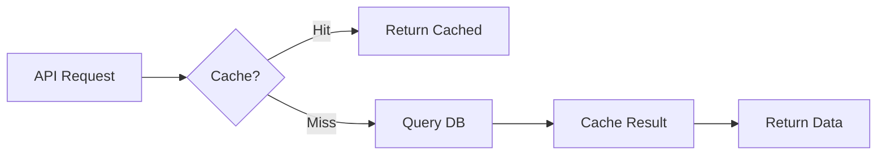

**Cache Targets**:
- Dashboard statistics (5 min TTL)
- Vendor master data (1 hour TTL)
- Ledger entries (1 hour TTL)
- Risk rules config (startup only)

### Database Optimization

- Indexes on frequently queried columns
- Query optimization (avoid N+1)
- Connection pooling
- Batch inserts for bulk operations
- Pagination for large result sets

### Frontend Optimization

- Code splitting (React.lazy)
- Image optimization
- Lazy loading for tables
- Debounced search (300ms)
- Virtual scrolling for large lists

---

## Scalability Considerations

### Horizontal Scaling

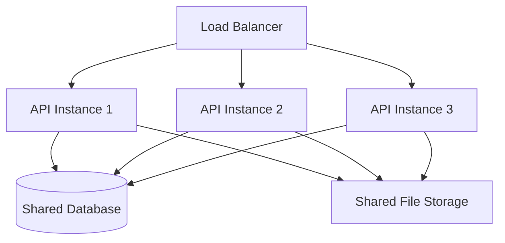

**Scaling Strategy**:
- Stateless API design
- Shared database (upgrade from SQLite to PostgreSQL)
- Centralized file storage (S3/cloud storage)
- Session management (Redis for future auth)
- Message queue for async processing (Celery + Redis)

---

## Monitoring & Logging

### Monitoring Architecture

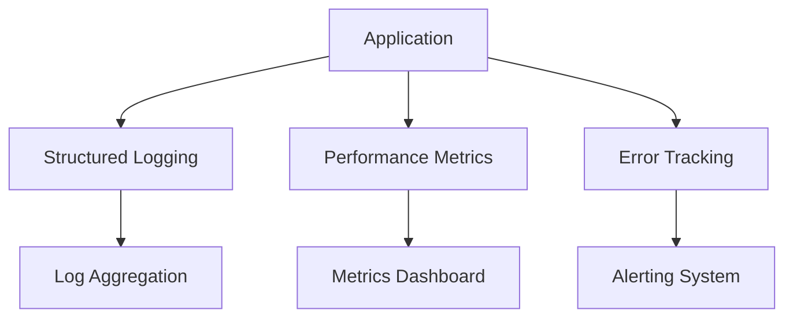

**Monitoring Points**:
- API response times
- Error rates
- Upload success/failure rates
- AI extraction accuracy
- Database query performance
- File storage usage

**Logging Strategy**:
- Structured JSON logs
- Log levels (DEBUG, INFO, WARN, ERROR)
- Request/response logging
- Audit trail logging
- Rotation and retention policies

---

## Disaster Recovery

### Backup Strategy

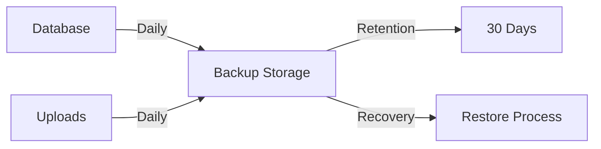

**Backup Plan**:
- Daily database backups
- Daily file storage backups
- 30-day retention
- Automated backup verification
- Disaster recovery runbook

---

**Version**: 1.0  
**Last Updated**: August 1, 2026  
**Next Review**: Post-Hackathon

---

**END OF ARCHITECTURE DOCUMENT**
