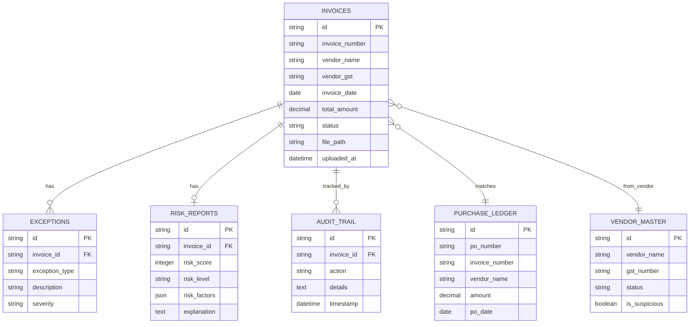
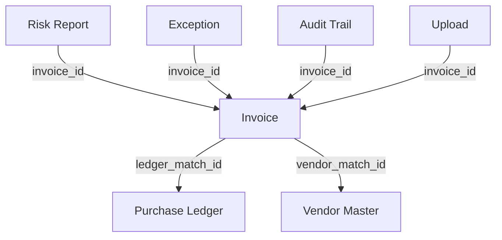

# Database Schema Design
## AI-Powered Invoice Audit & Risk Screening Platform

**Version**: 1.0  
**Date**: August 1, 2026  
**Database**: SQLite 3.40+

---

## Table of Contents
1. [ER Diagram](#er-diagram)
2. [Tables Overview](#tables-overview)
3. [Table Schemas](#table-schemas)
4. [Relationships](#relationships)
5. [Indexes](#indexes)
6. [Sample Data](#sample-data)
7. [SQL Schema](#sql-schema)

---

## ER Diagram




---

## Tables Overview

| Table | Purpose | Record Count (Est) |
|-------|---------|-------------------|
| **invoices** | Core invoice data extracted from documents | 1000+ |
| **purchase_ledger** | Purchase orders for matching | 5000+ |
| **vendor_master** | Approved vendor database | 500+ |
| **exceptions** | Validation failures and anomalies | 100+ |
| **risk_reports** | Risk scores and analysis | 1000+ |
| **audit_trail** | Immutable activity log | 5000+ |
| **uploads** | File upload tracking | 1000+ |

---

## Table Schemas

### 1. invoices

**Purpose**: Store extracted invoice information and processing status

| Column | Type | Constraints | Description |
|--------|------|-------------|-------------|
| `id` | TEXT | PRIMARY KEY | UUID generated for each invoice |
| `invoice_number` | TEXT | NOT NULL | Invoice number extracted from document |
| `vendor_name` | TEXT | NOT NULL | Vendor/supplier name |
| `vendor_gst` | TEXT | | GST number (15 chars) |
| `invoice_date` | DATE | NOT NULL | Invoice issue date |
| `due_date` | DATE | | Payment due date |
| `subtotal` | DECIMAL(15,2) | NOT NULL | Amount before tax |
| `tax_amount` | DECIMAL(15,2) | DEFAULT 0 | Tax/GST amount |
| `total_amount` | DECIMAL(15,2) | NOT NULL | Final amount including tax |
| `currency` | TEXT | DEFAULT 'INR' | Currency code |
| `line_items` | JSON | | Array of line items |
| `extracted_data` | JSON | | Full AI extraction response |
| `confidence_scores` | JSON | | Field-level confidence scores |
| `file_path` | TEXT | NOT NULL | Path to uploaded file |
| `file_type` | TEXT | NOT NULL | PDF, JPEG, PNG |
| `status` | TEXT | NOT NULL | PENDING, PROCESSED, FLAGGED, APPROVED |
| `ledger_match_id` | TEXT | | FK to purchase_ledger |
| `vendor_match_id` | TEXT | | FK to vendor_master |
| `is_duplicate` | BOOLEAN | DEFAULT FALSE | Duplicate flag |
| `uploaded_at` | DATETIME | DEFAULT CURRENT_TIMESTAMP | Upload timestamp |
| `processed_at` | DATETIME | | Processing completion time |
| `created_at` | DATETIME | DEFAULT CURRENT_TIMESTAMP | |
| `updated_at` | DATETIME | DEFAULT CURRENT_TIMESTAMP | |

**Indexes**:
- `idx_invoice_number` ON `invoice_number`
- `idx_vendor_name` ON `vendor_name`
- `idx_invoice_date` ON `invoice_date`
- `idx_total_amount` ON `total_amount`
- `idx_status` ON `status`
- `idx_uploaded_at` ON `uploaded_at`


### 2. purchase_ledger

**Purpose**: Purchase order records for invoice matching

| Column | Type | Constraints | Description |
|--------|------|-------------|-------------|
| `id` | TEXT | PRIMARY KEY | UUID |
| `po_number` | TEXT | NOT NULL UNIQUE | Purchase order number |
| `invoice_number` | TEXT | | Expected invoice number |
| `vendor_name` | TEXT | NOT NULL | Vendor name |
| `vendor_gst` | TEXT | | Vendor GST number |
| `po_date` | DATE | NOT NULL | PO issue date |
| `expected_amount` | DECIMAL(15,2) | NOT NULL | Expected invoice amount |
| `description` | TEXT | | Item/service description |
| `status` | TEXT | DEFAULT 'OPEN' | OPEN, MATCHED, CLOSED |
| `matched_invoice_id` | TEXT | | FK to invoices table |
| `created_at` | DATETIME | DEFAULT CURRENT_TIMESTAMP | |
| `updated_at` | DATETIME | DEFAULT CURRENT_TIMESTAMP | |

**Indexes**:
- `idx_po_number` ON `po_number`
- `idx_ledger_vendor` ON `vendor_name`
- `idx_ledger_invoice` ON `invoice_number`
- `idx_po_date` ON `po_date`
- `idx_ledger_status` ON `status`

### 3. vendor_master

**Purpose**: Approved vendor database for validation

| Column | Type | Constraints | Description |
|--------|------|-------------|-------------|
| `id` | TEXT | PRIMARY KEY | UUID |
| `vendor_name` | TEXT | NOT NULL | Official vendor name |
| `vendor_code` | TEXT | UNIQUE | Internal vendor code |
| `gst_number` | TEXT | UNIQUE | 15-character GST number |
| `pan_number` | TEXT | | PAN number |
| `email` | TEXT | | Contact email |
| `phone` | TEXT | | Contact phone |
| `address` | TEXT | | Full address |
| `city` | TEXT | | City |
| `state` | TEXT | | State |
| `country` | TEXT | DEFAULT 'India' | Country |
| `status` | TEXT | DEFAULT 'ACTIVE' | ACTIVE, INACTIVE, SUSPENDED |
| `is_suspicious` | BOOLEAN | DEFAULT FALSE | Risk flag |
| `risk_notes` | TEXT | | Risk explanation |
| `total_transactions` | INTEGER | DEFAULT 0 | Transaction count |
| `total_amount` | DECIMAL(15,2) | DEFAULT 0 | Total amount processed |
| `created_at` | DATETIME | DEFAULT CURRENT_TIMESTAMP | |
| `updated_at` | DATETIME | DEFAULT CURRENT_TIMESTAMP | |

**Indexes**:
- `idx_vendor_gst` ON `gst_number`
- `idx_vendor_status` ON `status`
- `idx_vendor_suspicious` ON `is_suspicious`

### 4. exceptions

**Purpose**: Track validation failures and anomalies

| Column | Type | Constraints | Description |
|--------|------|-------------|-------------|
| `id` | TEXT | PRIMARY KEY | UUID |
| `invoice_id` | TEXT | NOT NULL | FK to invoices |
| `exception_type` | TEXT | NOT NULL | DUPLICATE, MISSING_LEDGER, GST_MISMATCH, etc. |
| `exception_category` | TEXT | NOT NULL | VALIDATION, MATCHING, COMPLIANCE |
| `description` | TEXT | NOT NULL | Human-readable description |
| `severity` | TEXT | NOT NULL | LOW, MEDIUM, HIGH, CRITICAL |
| `field_name` | TEXT | | Field that caused exception |
| `expected_value` | TEXT | | Expected value |
| `actual_value` | TEXT | | Actual value found |
| `auto_detected` | BOOLEAN | DEFAULT TRUE | System vs manual flag |
| `resolved` | BOOLEAN | DEFAULT FALSE | Resolution status |
| `resolved_by` | TEXT | | User who resolved |
| `resolved_at` | DATETIME | | Resolution timestamp |
| `resolution_notes` | TEXT | | Resolution explanation |
| `created_at` | DATETIME | DEFAULT CURRENT_TIMESTAMP | |

**Indexes**:
- `idx_exception_invoice` ON `invoice_id`
- `idx_exception_type` ON `exception_type`
- `idx_exception_severity` ON `severity`
- `idx_exception_resolved` ON `resolved`

### 5. risk_reports

**Purpose**: Store risk assessment results

| Column | Type | Constraints | Description |
|--------|------|-------------|-------------|
| `id` | TEXT | PRIMARY KEY | UUID |
| `invoice_id` | TEXT | NOT NULL UNIQUE | FK to invoices (1-to-1) |
| `risk_score` | INTEGER | NOT NULL CHECK (risk_score >= 0 AND risk_score <= 100) | 0-100 risk score |
| `risk_level` | TEXT | NOT NULL | LOW, MEDIUM, HIGH, CRITICAL |
| `risk_factors` | JSON | NOT NULL | Array of detected risk factors |
| `rule_results` | JSON | | Individual rule evaluation results |
| `confidence_score` | DECIMAL(5,2) | | Overall confidence in assessment |
| `explanation` | TEXT | | AI-generated explanation |
| `recommendations` | TEXT | | Suggested actions |
| `duplicate_of` | TEXT | | ID of original if duplicate |
| `similarity_score` | DECIMAL(5,2) | | Similarity percentage |
| `requires_review` | BOOLEAN | DEFAULT FALSE | Manual review flag |
| `reviewed` | BOOLEAN | DEFAULT FALSE | Review completion flag |
| `reviewed_by` | TEXT | | Reviewer identifier |
| `reviewed_at` | DATETIME | | Review timestamp |
| `review_notes` | TEXT | | Reviewer comments |
| `created_at` | DATETIME | DEFAULT CURRENT_TIMESTAMP | |
| `updated_at` | DATETIME | DEFAULT CURRENT_TIMESTAMP | |

**Indexes**:
- `idx_risk_invoice` ON `invoice_id`
- `idx_risk_score` ON `risk_score`
- `idx_risk_level` ON `risk_level`
- `idx_risk_review` ON `requires_review`


### 6. audit_trail

**Purpose**: Immutable log of all system actions

| Column | Type | Constraints | Description |
|--------|------|-------------|-------------|
| `id` | TEXT | PRIMARY KEY | UUID |
| `invoice_id` | TEXT | | FK to invoices (nullable for system events) |
| `action` | TEXT | NOT NULL | UPLOAD, EXTRACT, MATCH, RISK_SCORE, REVIEW, etc. |
| `action_category` | TEXT | NOT NULL | SYSTEM, USER, AI |
| `actor` | TEXT | | User/system identifier |
| `details` | TEXT | | Action details |
| `metadata` | JSON | | Additional context |
| `old_values` | JSON | | Previous values (for updates) |
| `new_values` | JSON | | New values (for updates) |
| `ip_address` | TEXT | | Client IP (future) |
| `user_agent` | TEXT | | Client user agent (future) |
| `timestamp` | DATETIME | DEFAULT CURRENT_TIMESTAMP NOT NULL | Immutable timestamp |

**Indexes**:
- `idx_audit_invoice` ON `invoice_id`
- `idx_audit_action` ON `action`
- `idx_audit_timestamp` ON `timestamp`
- `idx_audit_actor` ON `actor`

### 7. uploads

**Purpose**: Track file uploads and processing metadata

| Column | Type | Constraints | Description |
|--------|------|-------------|-------------|
| `id` | TEXT | PRIMARY KEY | UUID |
| `original_filename` | TEXT | NOT NULL | User's filename |
| `stored_filename` | TEXT | NOT NULL UNIQUE | UUID-based storage name |
| `file_path` | TEXT | NOT NULL | Full path to file |
| `file_size` | INTEGER | NOT NULL | Size in bytes |
| `file_type` | TEXT | NOT NULL | MIME type |
| `file_extension` | TEXT | NOT NULL | .pdf, .jpg, .png |
| `upload_status` | TEXT | DEFAULT 'PENDING' | PENDING, PROCESSING, COMPLETED, FAILED |
| `processing_time_ms` | INTEGER | | Processing duration |
| `error_message` | TEXT | | Error if failed |
| `invoice_id` | TEXT | | FK to invoices (after processing) |
| `uploaded_by` | TEXT | | User identifier (future) |
| `uploaded_at` | DATETIME | DEFAULT CURRENT_TIMESTAMP | |
| `processed_at` | DATETIME | | |

**Indexes**:
- `idx_upload_status` ON `upload_status`
- `idx_upload_invoice` ON `invoice_id`
- `idx_upload_date` ON `uploaded_at`

---

## Relationships

### Entity Relationships

```sql
-- Invoice to Ledger (Many-to-One)
invoices.ledger_match_id -> purchase_ledger.id

-- Invoice to Vendor (Many-to-One)
invoices.vendor_match_id -> vendor_master.id

-- Invoice to Risk Report (One-to-One)
risk_reports.invoice_id -> invoices.id

-- Invoice to Exceptions (One-to-Many)
exceptions.invoice_id -> invoices.id

-- Invoice to Audit Trail (One-to-Many)
audit_trail.invoice_id -> invoices.id

-- Invoice to Upload (One-to-One)
uploads.invoice_id -> invoices.id

-- Ledger to Invoice (One-to-One for matched)
purchase_ledger.matched_invoice_id -> invoices.id
```

### Relationship Diagram



---

## Indexes

### Performance Optimization Indexes

```sql
-- Invoices table
CREATE INDEX idx_invoice_number ON invoices(invoice_number);
CREATE INDEX idx_vendor_name ON invoices(vendor_name);
CREATE INDEX idx_invoice_date ON invoices(invoice_date);
CREATE INDEX idx_total_amount ON invoices(total_amount);
CREATE INDEX idx_status ON invoices(status);
CREATE INDEX idx_uploaded_at ON invoices(uploaded_at);
CREATE INDEX idx_invoice_duplicate ON invoices(is_duplicate);

-- Purchase Ledger
CREATE INDEX idx_po_number ON purchase_ledger(po_number);
CREATE INDEX idx_ledger_vendor ON purchase_ledger(vendor_name);
CREATE INDEX idx_ledger_invoice ON purchase_ledger(invoice_number);
CREATE INDEX idx_po_date ON purchase_ledger(po_date);
CREATE INDEX idx_ledger_status ON purchase_ledger(status);

-- Vendor Master
CREATE INDEX idx_vendor_gst ON vendor_master(gst_number);
CREATE INDEX idx_vendor_status ON vendor_master(status);
CREATE INDEX idx_vendor_suspicious ON vendor_master(is_suspicious);

-- Exceptions
CREATE INDEX idx_exception_invoice ON exceptions(invoice_id);
CREATE INDEX idx_exception_type ON exceptions(exception_type);
CREATE INDEX idx_exception_severity ON exceptions(severity);
CREATE INDEX idx_exception_resolved ON exceptions(resolved);

-- Risk Reports
CREATE INDEX idx_risk_invoice ON risk_reports(invoice_id);
CREATE INDEX idx_risk_score ON risk_reports(risk_score);
CREATE INDEX idx_risk_level ON risk_reports(risk_level);
CREATE INDEX idx_risk_review ON risk_reports(requires_review);

-- Audit Trail
CREATE INDEX idx_audit_invoice ON audit_trail(invoice_id);
CREATE INDEX idx_audit_action ON audit_trail(action);
CREATE INDEX idx_audit_timestamp ON audit_trail(timestamp);

-- Uploads
CREATE INDEX idx_upload_status ON uploads(upload_status);
CREATE INDEX idx_upload_invoice ON uploads(invoice_id);
CREATE INDEX idx_upload_date ON uploads(uploaded_at);

-- Composite indexes for common queries
CREATE INDEX idx_invoice_vendor_date ON invoices(vendor_name, invoice_date);
CREATE INDEX idx_invoice_status_date ON invoices(status, uploaded_at);
CREATE INDEX idx_risk_level_score ON risk_reports(risk_level, risk_score);
```


---

## Sample Data

### Sample Invoice

```sql
INSERT INTO invoices VALUES (
  '550e8400-e29b-41d4-a716-446655440000',
  'INV-2024-001',
  'ABC Supplies Ltd',
  '29ABCDE1234F1Z5',
  '2024-07-15',
  '2024-08-15',
  50000.00,
  9000.00,
  59000.00,
  'INR',
  '[{"item": "Laptops", "qty": 10, "rate": 5000}]',
  '{"confidence": 0.95, "raw_text": "..."}',
  '{"invoice_number": 0.98, "vendor_name": 0.95, "amount": 0.99}',
  '/uploads/550e8400-e29b-41d4-a716-446655440000.pdf',
  'PDF',
  'PROCESSED',
  'ledger-123',
  'vendor-456',
  FALSE,
  '2024-07-20 10:30:00',
  '2024-07-20 10:35:00',
  '2024-07-20 10:30:00',
  '2024-07-20 10:35:00'
);
```

### Sample Purchase Ledger Entry

```sql
INSERT INTO purchase_ledger VALUES (
  'ledger-123',
  'PO-2024-100',
  'INV-2024-001',
  'ABC Supplies Ltd',
  '29ABCDE1234F1Z5',
  '2024-07-10',
  59000.00,
  '10 Laptops for IT department',
  'MATCHED',
  '550e8400-e29b-41d4-a716-446655440000',
  '2024-07-10 09:00:00',
  '2024-07-20 10:35:00'
);
```

### Sample Vendor Master Entry

```sql
INSERT INTO vendor_master VALUES (
  'vendor-456',
  'ABC Supplies Ltd',
  'VENDOR-ABC-001',
  '29ABCDE1234F1Z5',
  'ABCDE1234F',
  'contact@abcsupplies.com',
  '+91-9876543210',
  '123 Industrial Area, Phase 2',
  'Bangalore',
  'Karnataka',
  'India',
  'ACTIVE',
  FALSE,
  NULL,
  25,
  1250000.00,
  '2023-01-15 08:00:00',
  '2024-07-20 10:35:00'
);
```

### Sample Risk Report

```sql
INSERT INTO risk_reports VALUES (
  'risk-789',
  '550e8400-e29b-41d4-a716-446655440000',
  25,
  'LOW',
  '[
    {"rule": "matched_ledger", "triggered": false, "weight": 0},
    {"rule": "high_value", "triggered": true, "weight": 10},
    {"rule": "vendor_verified", "triggered": false, "weight": 0}
  ]',
  '{"total_rules": 12, "triggered": 1, "passed": 11}',
  0.95,
  'This invoice has low risk. It matched with purchase ledger PO-2024-100, vendor is verified in master database, and all validation checks passed. Flagged only for high value (>50,000 INR).',
  'Standard approval process recommended. No manual review required.',
  NULL,
  NULL,
  FALSE,
  FALSE,
  NULL,
  NULL,
  NULL,
  '2024-07-20 10:35:00',
  '2024-07-20 10:35:00'
);
```

### Sample Exception

```sql
INSERT INTO exceptions VALUES (
  'exc-101',
  '550e8400-e29b-41d4-a716-446655440001',
  'MISSING_LEDGER',
  'MATCHING',
  'No matching purchase order found in ledger',
  'HIGH',
  'invoice_number',
  'PO-2024-200',
  'INV-2024-999',
  TRUE,
  FALSE,
  NULL,
  NULL,
  NULL,
  '2024-07-20 11:00:00'
);
```

### Sample Audit Trail

```sql
INSERT INTO audit_trail VALUES (
  'audit-001',
  '550e8400-e29b-41d4-a716-446655440000',
  'UPLOAD',
  'SYSTEM',
  'system',
  'Invoice file uploaded successfully',
  '{"filename": "ABC_Invoice_July.pdf", "size": 245678}',
  NULL,
  NULL,
  NULL,
  NULL,
  '2024-07-20 10:30:00'
);

INSERT INTO audit_trail VALUES (
  'audit-002',
  '550e8400-e29b-41d4-a716-446655440000',
  'EXTRACT',
  'AI',
  'gemini-vision-api',
  'AI extraction completed',
  '{"confidence": 0.95, "processing_time_ms": 3500}',
  NULL,
  NULL,
  NULL,
  NULL,
  '2024-07-20 10:31:30'
);
```


---

## SQL Schema

### Complete SQLite Schema

```sql
-- ================================================
-- INVOICES TABLE
-- ================================================
CREATE TABLE IF NOT EXISTS invoices (
    id TEXT PRIMARY KEY,
    invoice_number TEXT NOT NULL,
    vendor_name TEXT NOT NULL,
    vendor_gst TEXT,
    invoice_date DATE NOT NULL,
    due_date DATE,
    subtotal DECIMAL(15,2) NOT NULL,
    tax_amount DECIMAL(15,2) DEFAULT 0,
    total_amount DECIMAL(15,2) NOT NULL,
    currency TEXT DEFAULT 'INR',
    line_items JSON,
    extracted_data JSON,
    confidence_scores JSON,
    file_path TEXT NOT NULL,
    file_type TEXT NOT NULL,
    status TEXT NOT NULL DEFAULT 'PENDING',
    ledger_match_id TEXT,
    vendor_match_id TEXT,
    is_duplicate BOOLEAN DEFAULT FALSE,
    uploaded_at DATETIME DEFAULT CURRENT_TIMESTAMP,
    processed_at DATETIME,
    created_at DATETIME DEFAULT CURRENT_TIMESTAMP,
    updated_at DATETIME DEFAULT CURRENT_TIMESTAMP,
    FOREIGN KEY (ledger_match_id) REFERENCES purchase_ledger(id),
    FOREIGN KEY (vendor_match_id) REFERENCES vendor_master(id),
    CHECK (status IN ('PENDING', 'PROCESSING', 'PROCESSED', 'FLAGGED', 'APPROVED', 'REJECTED'))
);

CREATE INDEX idx_invoice_number ON invoices(invoice_number);
CREATE INDEX idx_vendor_name ON invoices(vendor_name);
CREATE INDEX idx_invoice_date ON invoices(invoice_date);
CREATE INDEX idx_total_amount ON invoices(total_amount);
CREATE INDEX idx_status ON invoices(status);
CREATE INDEX idx_uploaded_at ON invoices(uploaded_at);
CREATE INDEX idx_invoice_duplicate ON invoices(is_duplicate);
CREATE INDEX idx_invoice_vendor_date ON invoices(vendor_name, invoice_date);
CREATE INDEX idx_invoice_status_date ON invoices(status, uploaded_at);

-- ================================================
-- PURCHASE LEDGER TABLE
-- ================================================
CREATE TABLE IF NOT EXISTS purchase_ledger (
    id TEXT PRIMARY KEY,
    po_number TEXT NOT NULL UNIQUE,
    invoice_number TEXT,
    vendor_name TEXT NOT NULL,
    vendor_gst TEXT,
    po_date DATE NOT NULL,
    expected_amount DECIMAL(15,2) NOT NULL,
    description TEXT,
    status TEXT DEFAULT 'OPEN',
    matched_invoice_id TEXT,
    created_at DATETIME DEFAULT CURRENT_TIMESTAMP,
    updated_at DATETIME DEFAULT CURRENT_TIMESTAMP,
    FOREIGN KEY (matched_invoice_id) REFERENCES invoices(id),
    CHECK (status IN ('OPEN', 'MATCHED', 'CLOSED', 'CANCELLED'))
);

CREATE INDEX idx_po_number ON purchase_ledger(po_number);
CREATE INDEX idx_ledger_vendor ON purchase_ledger(vendor_name);
CREATE INDEX idx_ledger_invoice ON purchase_ledger(invoice_number);
CREATE INDEX idx_po_date ON purchase_ledger(po_date);
CREATE INDEX idx_ledger_status ON purchase_ledger(status);

-- ================================================
-- VENDOR MASTER TABLE
-- ================================================
CREATE TABLE IF NOT EXISTS vendor_master (
    id TEXT PRIMARY KEY,
    vendor_name TEXT NOT NULL,
    vendor_code TEXT UNIQUE,
    gst_number TEXT UNIQUE,
    pan_number TEXT,
    email TEXT,
    phone TEXT,
    address TEXT,
    city TEXT,
    state TEXT,
    country TEXT DEFAULT 'India',
    status TEXT DEFAULT 'ACTIVE',
    is_suspicious BOOLEAN DEFAULT FALSE,
    risk_notes TEXT,
    total_transactions INTEGER DEFAULT 0,
    total_amount DECIMAL(15,2) DEFAULT 0,
    created_at DATETIME DEFAULT CURRENT_TIMESTAMP,
    updated_at DATETIME DEFAULT CURRENT_TIMESTAMP,
    CHECK (status IN ('ACTIVE', 'INACTIVE', 'SUSPENDED', 'BLACKLISTED'))
);

CREATE INDEX idx_vendor_gst ON vendor_master(gst_number);
CREATE INDEX idx_vendor_status ON vendor_master(status);
CREATE INDEX idx_vendor_suspicious ON vendor_master(is_suspicious);

-- ================================================
-- EXCEPTIONS TABLE
-- ================================================
CREATE TABLE IF NOT EXISTS exceptions (
    id TEXT PRIMARY KEY,
    invoice_id TEXT NOT NULL,
    exception_type TEXT NOT NULL,
    exception_category TEXT NOT NULL,
    description TEXT NOT NULL,
    severity TEXT NOT NULL,
    field_name TEXT,
    expected_value TEXT,
    actual_value TEXT,
    auto_detected BOOLEAN DEFAULT TRUE,
    resolved BOOLEAN DEFAULT FALSE,
    resolved_by TEXT,
    resolved_at DATETIME,
    resolution_notes TEXT,
    created_at DATETIME DEFAULT CURRENT_TIMESTAMP,
    FOREIGN KEY (invoice_id) REFERENCES invoices(id) ON DELETE CASCADE,
    CHECK (exception_category IN ('VALIDATION', 'MATCHING', 'COMPLIANCE', 'DUPLICATE')),
    CHECK (severity IN ('LOW', 'MEDIUM', 'HIGH', 'CRITICAL'))
);

CREATE INDEX idx_exception_invoice ON exceptions(invoice_id);
CREATE INDEX idx_exception_type ON exceptions(exception_type);
CREATE INDEX idx_exception_severity ON exceptions(severity);
CREATE INDEX idx_exception_resolved ON exceptions(resolved);

-- ================================================
-- RISK REPORTS TABLE
-- ================================================
CREATE TABLE IF NOT EXISTS risk_reports (
    id TEXT PRIMARY KEY,
    invoice_id TEXT NOT NULL UNIQUE,
    risk_score INTEGER NOT NULL CHECK (risk_score >= 0 AND risk_score <= 100),
    risk_level TEXT NOT NULL,
    risk_factors JSON NOT NULL,
    rule_results JSON,
    confidence_score DECIMAL(5,2),
    explanation TEXT,
    recommendations TEXT,
    duplicate_of TEXT,
    similarity_score DECIMAL(5,2),
    requires_review BOOLEAN DEFAULT FALSE,
    reviewed BOOLEAN DEFAULT FALSE,
    reviewed_by TEXT,
    reviewed_at DATETIME,
    review_notes TEXT,
    created_at DATETIME DEFAULT CURRENT_TIMESTAMP,
    updated_at DATETIME DEFAULT CURRENT_TIMESTAMP,
    FOREIGN KEY (invoice_id) REFERENCES invoices(id) ON DELETE CASCADE,
    CHECK (risk_level IN ('LOW', 'MEDIUM', 'HIGH', 'CRITICAL'))
);

CREATE INDEX idx_risk_invoice ON risk_reports(invoice_id);
CREATE INDEX idx_risk_score ON risk_reports(risk_score);
CREATE INDEX idx_risk_level ON risk_reports(risk_level);
CREATE INDEX idx_risk_review ON risk_reports(requires_review);
CREATE INDEX idx_risk_level_score ON risk_reports(risk_level, risk_score);

-- ================================================
-- AUDIT TRAIL TABLE
-- ================================================
CREATE TABLE IF NOT EXISTS audit_trail (
    id TEXT PRIMARY KEY,
    invoice_id TEXT,
    action TEXT NOT NULL,
    action_category TEXT NOT NULL,
    actor TEXT,
    details TEXT,
    metadata JSON,
    old_values JSON,
    new_values JSON,
    ip_address TEXT,
    user_agent TEXT,
    timestamp DATETIME DEFAULT CURRENT_TIMESTAMP NOT NULL,
    FOREIGN KEY (invoice_id) REFERENCES invoices(id) ON DELETE SET NULL,
    CHECK (action_category IN ('SYSTEM', 'USER', 'AI', 'BATCH'))
);

CREATE INDEX idx_audit_invoice ON audit_trail(invoice_id);
CREATE INDEX idx_audit_action ON audit_trail(action);
CREATE INDEX idx_audit_timestamp ON audit_trail(timestamp);
CREATE INDEX idx_audit_actor ON audit_trail(actor);

-- ================================================
-- UPLOADS TABLE
-- ================================================
CREATE TABLE IF NOT EXISTS uploads (
    id TEXT PRIMARY KEY,
    original_filename TEXT NOT NULL,
    stored_filename TEXT NOT NULL UNIQUE,
    file_path TEXT NOT NULL,
    file_size INTEGER NOT NULL,
    file_type TEXT NOT NULL,
    file_extension TEXT NOT NULL,
    upload_status TEXT DEFAULT 'PENDING',
    processing_time_ms INTEGER,
    error_message TEXT,
    invoice_id TEXT,
    uploaded_by TEXT,
    uploaded_at DATETIME DEFAULT CURRENT_TIMESTAMP,
    processed_at DATETIME,
    FOREIGN KEY (invoice_id) REFERENCES invoices(id),
    CHECK (upload_status IN ('PENDING', 'PROCESSING', 'COMPLETED', 'FAILED'))
);

CREATE INDEX idx_upload_status ON uploads(upload_status);
CREATE INDEX idx_upload_invoice ON uploads(invoice_id);
CREATE INDEX idx_upload_date ON uploads(uploaded_at);

-- ================================================
-- TRIGGERS FOR UPDATED_AT
-- ================================================
CREATE TRIGGER update_invoice_timestamp 
AFTER UPDATE ON invoices
BEGIN
    UPDATE invoices SET updated_at = CURRENT_TIMESTAMP WHERE id = NEW.id;
END;

CREATE TRIGGER update_ledger_timestamp 
AFTER UPDATE ON purchase_ledger
BEGIN
    UPDATE purchase_ledger SET updated_at = CURRENT_TIMESTAMP WHERE id = NEW.id;
END;

CREATE TRIGGER update_vendor_timestamp 
AFTER UPDATE ON vendor_master
BEGIN
    UPDATE vendor_master SET updated_at = CURRENT_TIMESTAMP WHERE id = NEW.id;
END;

CREATE TRIGGER update_risk_timestamp 
AFTER UPDATE ON risk_reports
BEGIN
    UPDATE risk_reports SET updated_at = CURRENT_TIMESTAMP WHERE id = NEW.id;
END;
```

---

## Database Initialization Script

### Python Script (using SQLAlchemy)

```python
from sqlalchemy import create_engine
from sqlalchemy.orm import sessionmaker
import csv
import json

# Initialize database
engine = create_engine('sqlite:///database.db')
Session = sessionmaker(bind=engine)

def init_database():
    """Create all tables"""
    # Execute schema SQL file
    with open('schema.sql', 'r') as f:
        schema = f.read()
    engine.execute(schema)
    print("✅ Database schema created")

def import_ledger_csv(csv_path='data/purchase_ledger.csv'):
    """Import purchase ledger from CSV"""
    session = Session()
    with open(csv_path, 'r') as f:
        reader = csv.DictReader(f)
        for row in reader:
            # Insert into purchase_ledger
            session.execute("""
                INSERT INTO purchase_ledger 
                (id, po_number, vendor_name, po_date, expected_amount, status)
                VALUES (?, ?, ?, ?, ?, 'OPEN')
            """, (
                row['id'],
                row['po_number'],
                row['vendor_name'],
                row['po_date'],
                row['expected_amount']
            ))
    session.commit()
    print("✅ Purchase ledger imported")

def import_vendor_csv(csv_path='data/vendor_master.csv'):
    """Import vendor master from CSV"""
    session = Session()
    with open(csv_path, 'r') as f:
        reader = csv.DictReader(f)
        for row in reader:
            session.execute("""
                INSERT INTO vendor_master 
                (id, vendor_name, gst_number, status, is_suspicious)
                VALUES (?, ?, ?, 'ACTIVE', ?)
            """, (
                row['id'],
                row['vendor_name'],
                row['gst_number'],
                row.get('is_suspicious', 'FALSE') == 'TRUE'
            ))
    session.commit()
    print("✅ Vendor master imported")

if __name__ == '__main__':
    init_database()
    import_ledger_csv()
    import_vendor_csv()
    print("✅ Database initialized successfully")
```

---

**Version**: 1.0  
**Last Updated**: August 1, 2026  

---

**END OF DATABASE DOCUMENT**
