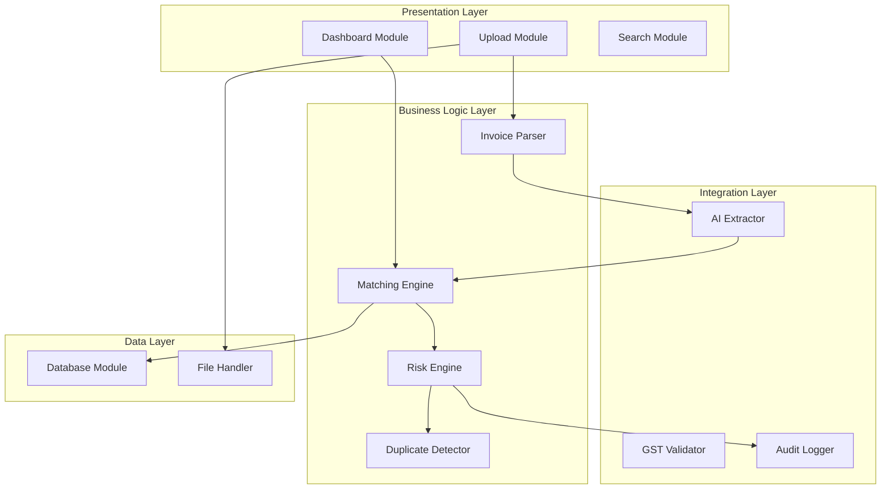
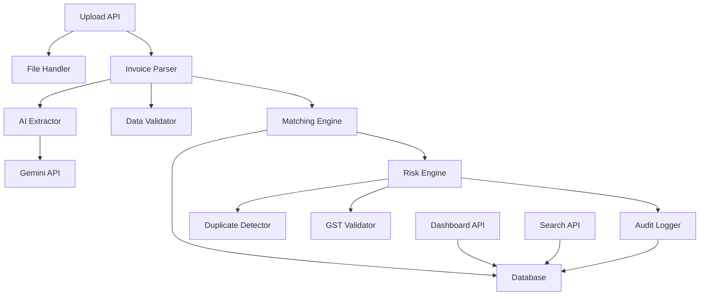

# Module Breakdown
## AI-Powered Invoice Audit & Risk Screening Platform

**Version**: 1.0  
**Date**: August 1, 2026  

---

## Table of Contents
1. [Module Overview](#module-overview)
2. [Backend Modules](#backend-modules)
3. [Frontend Modules](#frontend-modules)
4. [Shared Utilities](#shared-utilities)
5. [Module Dependencies](#module-dependencies)

---

## Module Overview

### Architecture Layers




---

## Backend Modules

### 1. Upload Module

**File**: `backend/app/api/upload.py`

**Purpose**: Handle file uploads, validation, and initial processing

**Responsibilities**:
- Accept multipart file uploads
- Validate file type (PDF, JPEG, PNG)
- Validate file size (<10MB)
- Generate unique UUID for each file
- Save file to `/uploads/` directory
- Create initial database record
- Trigger invoice processing pipeline

**Inputs**:
- `file`: UploadFile (multipart/form-data)
- Optional metadata (tags, notes)

**Outputs**:
- `invoice_id`: UUID
- `status`: Upload status
- `message`: Success/error message

**Key Functions**:
```python
async def upload_invoice(file: UploadFile) -> UploadResponse
async def validate_file(file: UploadFile) -> bool
async def save_file(file: UploadFile, file_id: str) -> str
async def create_invoice_record(file_data: dict) -> Invoice
```

**Dependencies**:
- File Handler (validation, storage)
- Database module
- Audit Logger

**Future Improvements**:
- Batch upload support
- Virus scanning integration
- Cloud storage (S3) support
- Progress tracking for large files

---

### 2. Invoice Parser Module

**File**: `backend/app/services/invoice_parser.py`

**Purpose**: Orchestrate invoice data extraction from documents

**Responsibilities**:
- Convert PDF to images if needed
- Call AI Extractor service
- Parse and validate AI response
- Structure extracted data
- Calculate confidence scores
- Handle extraction errors

**Inputs**:
- `file_path`: Path to uploaded invoice
- `file_type`: PDF, JPEG, PNG

**Outputs**:
- `extracted_data`: InvoiceData schema
- `confidence_scores`: dict
- `raw_response`: AI raw response

**Key Functions**:
```python
async def parse_invoice(file_path: str) -> ParsedInvoice
async def preprocess_file(file_path: str) -> bytes
async def validate_extraction(data: dict) -> bool
def calculate_confidence(data: dict) -> dict
```

**Dependencies**:
- AI Extractor
- Data Validator
- File Handler (PDF/image processing)

**Future Improvements**:
- Multi-language support
- Table extraction (line items)
- Handwriting recognition
- Custom field extraction

---

### 3. AI Extractor Module

**File**: `backend/app/services/ai_extractor.py`

**Purpose**: Interface with Gemini Vision API for OCR and data extraction

**Responsibilities**:
- Prepare Gemini API request
- Define structured extraction prompt
- Send document to Gemini Vision
- Parse JSON response
- Handle API errors and retries
- Rate limiting management

**Inputs**:
- `image_data`: Base64 encoded image/PDF
- `extraction_schema`: Expected JSON structure

**Outputs**:
- `extracted_json`: Structured invoice data
- `confidence`: Overall confidence score
- `raw_response`: Full API response

**Key Functions**:
```python
async def extract_invoice_data(image_data: bytes) -> ExtractionResult
def create_extraction_prompt() -> str
async def call_gemini_api(prompt: str, image: bytes) -> dict
def parse_gemini_response(response: dict) -> dict
```

**Prompt Template**:
```python
EXTRACTION_PROMPT = """
Extract the following information from this invoice image and return as JSON:

{
  "invoice_number": "string",
  "vendor_name": "string",
  "vendor_gst": "string (15 chars)",
  "invoice_date": "YYYY-MM-DD",
  "due_date": "YYYY-MM-DD",
  "subtotal": float,
  "tax_amount": float,
  "total_amount": float,
  "currency": "INR",
  "line_items": [
    {"item": "string", "quantity": int, "rate": float, "amount": float}
  ]
}

Return ONLY valid JSON. If a field is not found, use null.
"""
```

**Dependencies**:
- Google Gemini API
- Environment config (API key)

**Future Improvements**:
- Fallback to multiple AI models
- Custom model fine-tuning
- Confidence calibration
- Batch processing

---

### 4. Matching Engine Module

**File**: `backend/app/services/matching_engine.py`

**Purpose**: Match invoices with purchase ledger and vendor master

**Responsibilities**:
- Query purchase ledger by invoice number
- Match vendor information
- Compare amounts with tolerance
- Fuzzy matching for vendor names
- Flag unmatched invoices
- Update match status in database

**Inputs**:
- `invoice`: Invoice object
- `tolerance`: Amount match tolerance (default 1%)

**Outputs**:
- `match_result`: MatchResult object
- `ledger_entry`: Matched PO (if found)
- `vendor_entry`: Matched vendor (if found)
- `match_confidence`: 0-100 score

**Key Functions**:
```python
async def match_invoice(invoice: Invoice) -> MatchResult
async def find_ledger_entry(invoice_number: str) -> Optional[LedgerEntry]
async def find_vendor(vendor_name: str, gst: str) -> Optional[Vendor]
def fuzzy_match_vendor(name: str, threshold: float = 0.8) -> list
def compare_amounts(amount1: float, amount2: float, tolerance: float) -> bool
```

**Matching Logic**:
```python
# 1. Exact invoice number match
ledger = query(purchase_ledger).filter(invoice_number == invoice.invoice_number)

# 2. Fuzzy vendor name match (Levenshtein distance)
if not ledger:
    similar_vendors = fuzzy_match(invoice.vendor_name, threshold=0.85)
    
# 3. Amount comparison with tolerance
amount_matches = abs(invoice.amount - ledger.amount) <= (ledger.amount * tolerance)

# 4. GST validation
gst_matches = invoice.vendor_gst == ledger.vendor_gst
```

**Dependencies**:
- Database module
- Fuzzy matching library (python-Levenshtein)
- Data Validator

**Future Improvements**:
- ML-based matching
- Historical pattern analysis
- Multi-field matching (date, description)
- Vendor alias management

---

### 5. Risk Engine Module

**File**: `backend/app/services/risk_engine.py`

**Purpose**: Evaluate invoices against risk rules and calculate risk scores

**Responsibilities**:
- Apply 12+ risk detection rules
- Calculate weighted risk score (0-100)
- Categorize risk level (Low/Med/High/Critical)
- Generate risk explanations
- Flag high-risk invoices
- Store risk reports

**Inputs**:
- `invoice`: Invoice object
- `match_result`: Matching results
- `extraction_confidence`: AI confidence scores

**Outputs**:
- `risk_report`: RiskReport object
- `risk_score`: 0-100
- `risk_level`: LOW, MEDIUM, HIGH, CRITICAL
- `risk_factors`: List of triggered rules
- `explanation`: Plain language explanation

**Risk Rules**:
```python
RISK_RULES = {
    'duplicate_invoice': {
        'weight': 30,
        'check': lambda inv: check_duplicate_invoice_number(inv),
        'severity': 'CRITICAL'
    },
    'duplicate_amount': {
        'weight': 25,
        'check': lambda inv: check_duplicate_amount(inv),
        'severity': 'HIGH'
    },
    'missing_ledger': {
        'weight': 20,
        'check': lambda inv: inv.ledger_match_id is None,
        'severity': 'HIGH'
    },
    'gst_mismatch': {
        'weight': 15,
        'check': lambda inv: check_gst_mismatch(inv),
        'severity': 'MEDIUM'
    },
    'invalid_gst': {
        'weight': 15,
        'check': lambda inv: not validate_gst_format(inv.vendor_gst),
        'severity': 'MEDIUM'
    },
    'vendor_not_found': {
        'weight': 20,
        'check': lambda inv: inv.vendor_match_id is None,
        'severity': 'HIGH'
    },
    'amount_mismatch': {
        'weight': 15,
        'check': lambda inv: check_amount_mismatch(inv),
        'severity': 'MEDIUM'
    },
    'date_mismatch': {
        'weight': 10,
        'check': lambda inv: check_date_anomaly(inv),
        'severity': 'LOW'
    },
    'suspicious_vendor': {
        'weight': 25,
        'check': lambda inv: check_suspicious_vendor(inv),
        'severity': 'CRITICAL'
    },
    'high_value': {
        'weight': 10,
        'check': lambda inv: inv.total_amount > 100000,
        'severity': 'MEDIUM'
    },
    'repeated_transactions': {
        'weight': 15,
        'check': lambda inv: check_repeated_transactions(inv),
        'severity': 'MEDIUM'
    },
    'low_confidence': {
        'weight': 20,
        'check': lambda inv: inv.confidence_scores['overall'] < 0.7,
        'severity': 'HIGH'
    }
}
```

**Key Functions**:
```python
async def calculate_risk_score(invoice: Invoice) -> RiskReport
def apply_risk_rules(invoice: Invoice) -> list[RuleResult]
def generate_risk_explanation(risk_factors: list) -> str
async def check_duplicate_invoice(invoice: Invoice) -> bool
async def check_duplicate_amount(invoice: Invoice) -> bool
```

**Dependencies**:
- Duplicate Detector
- GST Validator
- Database module
- Audit Logger

**Future Improvements**:
- ML-based anomaly detection
- Custom risk rules builder
- Risk pattern learning
- Vendor risk scoring


---

### 6. Duplicate Detector Module

**File**: `backend/app/services/duplicate_detector.py`

**Purpose**: Detect duplicate and similar invoices

**Responsibilities**:
- Check exact invoice number duplicates
- Find similar amounts within time window
- Calculate invoice similarity score
- Flag potential duplicates

**Key Functions**:
```python
async def check_duplicate(invoice: Invoice) -> DuplicateResult
async def find_similar_invoices(invoice: Invoice) -> list[Invoice]
def calculate_similarity(inv1: Invoice, inv2: Invoice) -> float
```

**Dependencies**: Database module, String matching utilities

---

### 7. GST Validator Module

**File**: `backend/app/services/gst_validator.py`

**Purpose**: Validate Indian GST numbers

**Responsibilities**:
- Format validation (15 characters)
- Checksum validation
- State code verification

**Key Functions**:
```python
def validate_gst_format(gst: str) -> bool
def validate_gst_checksum(gst: str) -> bool
def extract_state_code(gst: str) -> str
```

**Dependencies**: None (standalone)

---

### 8. Audit Logger Module

**File**: `backend/app/services/audit_logger.py`

**Purpose**: Log all system actions immutably

**Responsibilities**:
- Log invoice lifecycle events
- Track user actions
- Store metadata
- Ensure immutability

**Key Functions**:
```python
async def log_action(invoice_id: str, action: str, details: dict)
async def get_audit_trail(invoice_id: str) -> list[AuditEntry]
```

**Dependencies**: Database module

---

### 9. Dashboard Module

**File**: `backend/app/api/dashboard.py`

**Purpose**: Provide aggregate statistics and analytics

**Responsibilities**:
- Calculate summary metrics
- Generate chart data
- Recent invoices list
- Exception alerts

**Key Functions**:
```python
async def get_summary_stats() -> DashboardStats
async def get_risk_distribution() -> dict
async def get_recent_invoices(limit: int) -> list[Invoice]
async def get_top_vendors() -> list[VendorStats]
```

**Dependencies**: Database module, Analytics utilities

---

### 10. Search Module

**File**: `backend/app/api/search.py`

**Purpose**: Full-text search and filtering

**Responsibilities**:
- Text search across invoices
- Multi-field filtering
- Sorting and pagination
- Export functionality

**Key Functions**:
```python
async def search_invoices(query: str, filters: SearchFilters) -> SearchResult
async def export_results(invoice_ids: list[str], format: str) -> bytes
```

**Dependencies**: Database module, Export utilities

---

## Frontend Modules

### 11. Dashboard Component

**File**: `frontend/src/pages/Dashboard.tsx`

**Purpose**: Main dashboard view

**Responsibilities**:
- Display summary cards
- Render charts (risk distribution, vendors, trends)
- Show recent invoices table
- Exception alerts
- Auto-refresh data

**Key Components**:
- SummaryCards
- RiskChart (Recharts)
- VendorChart
- RecentInvoicesTable
- ExceptionAlerts

**State Management**:
```typescript
const [stats, setStats] = useState<DashboardStats>()
const [loading, setLoading] = useState(true)
```

**Dependencies**: API service, Chart components, UI components

---

### 12. Upload Component

**File**: `frontend/src/pages/Upload.tsx`

**Purpose**: File upload interface

**Responsibilities**:
- Drag-and-drop zone
- File picker
- Upload progress
- File validation
- Success/error messages

**Key Components**:
- DropZone
- FilePreview
- UploadProgress
- ErrorAlert

**Dependencies**: Upload service, File validation utilities

---

### 13. Invoice List Component

**File**: `frontend/src/pages/InvoiceList.tsx`

**Purpose**: Searchable, filterable invoice table

**Responsibilities**:
- Display invoices in table
- Search functionality
- Filters (risk, date, vendor, amount)
- Sorting
- Pagination
- Quick actions

**Dependencies**: Invoice service, Table component, Filter components

---

### 14. Invoice Detail Component

**File**: `frontend/src/pages/InvoiceDetails.tsx`

**Purpose**: Detailed invoice view

**Responsibilities**:
- Display extracted data
- Show file preview
- Risk analysis panel
- Audit trail
- Manual override actions

**Dependencies**: Invoice service, PDF viewer, Risk components

---

## Shared Utilities

### 15. File Handler Utility

**File**: `backend/app/utils/file_handler.py`

**Purpose**: File operations

**Key Functions**:
```python
def save_upload(file: UploadFile, file_id: str) -> str
def delete_file(file_path: str) -> bool
def get_file_info(file_path: str) -> FileInfo
def convert_pdf_to_images(pdf_path: str) -> list[bytes]
```

---

### 16. Data Validator Utility

**File**: `backend/app/utils/validators.py`

**Purpose**: Input validation

**Key Functions**:
```python
def validate_amount(amount: str) -> float
def validate_date(date_str: str) -> date
def validate_gst(gst: str) -> bool
def sanitize_input(input_str: str) -> str
```

---

### 17. Formatters Utility

**File**: `frontend/src/utils/formatters.ts`

**Purpose**: Data formatting for display

**Key Functions**:
```typescript
export const formatCurrency = (amount: number) => string
export const formatDate = (date: string) => string
export const formatRiskLevel = (level: string) => JSX.Element
export const formatConfidence = (score: number) => string
```

---

## Module Dependencies



---

**Version**: 1.0  
**Last Updated**: August 1, 2026

---

**END OF MODULES DOCUMENT**
