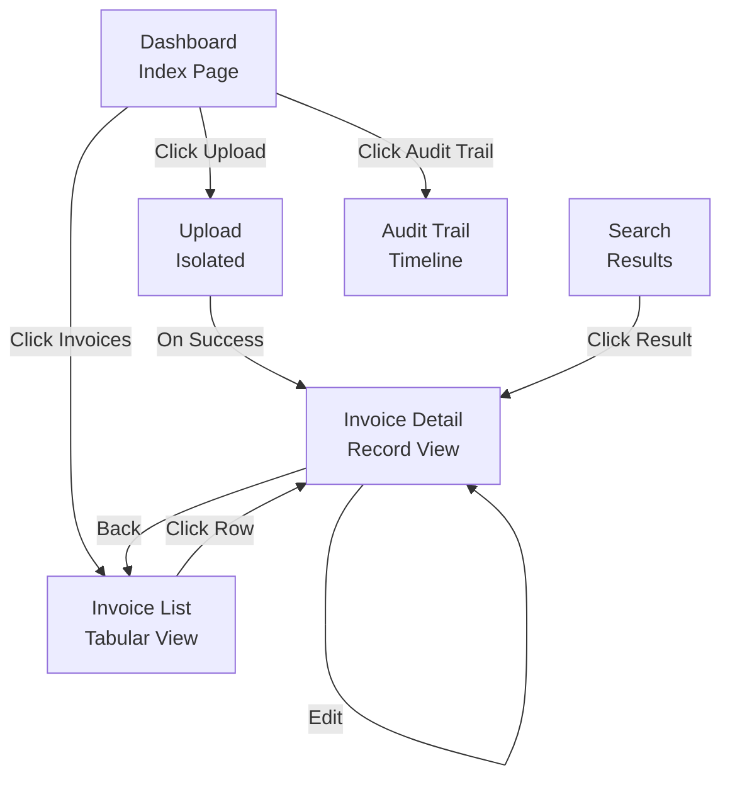

# Navigation Architecture
## AI-Powered Invoice Audit & Risk Screening Platform

**Version**: 1.0  
**Date**: August 1, 2026

---

## Table of Contents
1. [Navigation Structure](#navigation-structure)
2. [Header Component](#header-component)
3. [Sidebar Navigation](#sidebar-navigation)
4. [Mobile Navigation](#mobile-navigation)
5. [Breadcrumbs](#breadcrumbs)
6. [User Flows](#user-flows)

---

## Navigation Structure

### Site Navigation Map

```
/ (Dashboard)
├── /upload
├── /invoices
│   └── /invoices/:id
│       └── /invoices/:id/edit
├── /search
├── /audit-trail
└── /settings (future)
```

---

## Header Component

### Desktop Header Layout

```
┌─────────────────────────────────────────────────────────┐
│ 🏢 Logo │ Dashboard   │ Search Bar │ ⚙️  👤  🔔  User Menu│
└─────────────────────────────────────────────────────────┘
```

**Components**:
- **Logo** (clickable → home)
  - Brand icon (40x40px)
  - Text label (optional)
  - Hover: Shows tooltip

- **Current Page Title**
  - Dynamic based on route
  - E.g., "Dashboard", "Invoices", "Upload"

- **Search Bar** (global search)
  - Placeholder: "Search invoices..."
  - Icon: Magnifying glass
  - On focus: Expands, shows suggestions
  - Debounced 300ms

- **Icons & Menus**
  - Settings (gear icon) → Settings page
  - Notifications (bell icon) → Notification drawer
  - User Menu (avatar + name) → Dropdown

**User Dropdown Menu**:
```
Profile
Settings
Logout
```

**Responsive**:
- Desktop: Full header
- Tablet: Compact search, icons visible
- Mobile: Logo + hamburger menu

---

## Sidebar Navigation

### Desktop Sidebar (Left)

```
┌────────────────────────┐
│ 🏢 InvoiceGuard AI     │  (header)
├────────────────────────┤
│                        │
│ 🏠  Dashboard          │  (active)
│ 📤  Upload             │
│ 📋  Invoices           │
│ 🔍  Search             │
│ 📊  Audit Trail        │
│ ⚙️  Settings           │
│                        │
├────────────────────────┤
│ Help & Support         │  (footer)
│ Keyboard Shortcuts     │
│ About                  │
└────────────────────────┘
```

**Properties**:
- Width: 280px (desktop), collapsible
- Background: var(--color-bg-secondary)
- Border Right: 1px solid var(--color-border)
- Position: Fixed or sticky
- Z-index: 100

**Nav Items**:
- Icon (24x24px)
- Label (14px)
- Padding: 12px 16px
- Hover: Light background
- Active: Blue left border (3px) + bold text

**Collapse Button**:
- Double-arrow icon (top-right)
- Toggle between full (280px) and icon-only (60px)
- Animate width transition (200ms)

### Mobile Sidebar (Hamburger)

```
┌──────────────────┐
│ ☰                │  (header)
│ Dashboard        │
│ Upload           │
│ Invoices         │
│ Search           │
│ Audit Trail      │
│ Settings         │
│ ━━━━━━━━━━━━    │  (divider)
│ Help & Support   │
│ About            │
│ × Close          │
└──────────────────┘
```

**Properties**:
- Overlay modal on mobile
- Full height
- Slide in from left (300ms)
- Backdrop fade
- Close on item click

---

## Mobile Navigation

### Bottom Navigation Bar

```
┌─────────────────────────┐
│                         │  (content area)
│                         │
├─────────────────────────┤
│ 🏠  📤  📋  🔍  ☰      │  (bottom nav)
└─────────────────────────┘
```

**Tab Items** (5 tabs):
1. **Home** (Dashboard)
2. **Upload** (Upload Page)
3. **Invoices** (List)
4. **Search** (Search Page)
5. **Menu** (Hamburger - more options)

**Properties**:
- Height: 64px
- Background: var(--color-bg-primary)
- Border Top: 1px solid var(--color-border)
- Position: Fixed bottom
- Z-index: 99

**Active Tab**:
- Icon: Colored (primary blue)
- Label: Visible
- Background: Light blue

**Inactive Tab**:
- Icon: Gray
- Label: Hidden or shown on demand

---

## Breadcrumbs

### Breadcrumb Trail

```
Dashboard > Invoices > INV-2024-001 > Edit
```

**Properties**:
- Position: Below header
- Padding: 8px 16px
- Font Size: 12px

**Item Styling**:
- Separator: `/` or `>`
- Links: Blue, underline on hover
- Current: Gray (not clickable)

**Implementation**:
```tsx
<Breadcrumb>
  <Link to="/dashboard">Dashboard</Link>
  <Separator />
  <Link to="/invoices">Invoices</Link>
  <Separator />
  <Span>{invoiceNumber}</Span>
</Breadcrumb>
```

---

## Keyboard Navigation

### Keyboard Shortcuts

| Key | Action |
|-----|--------|
| `Cmd/Ctrl + K` | Open global search |
| `Cmd/Ctrl + /` | Show help + shortcuts |
| `/` | Focus search bar |
| `Esc` | Close modals, close sidebar (mobile) |
| `Tab` | Navigate to next element |
| `Shift + Tab` | Navigate to previous element |
| `Enter` | Activate button/link |
| `Space` | Toggle checkbox |
| `Arrow Up/Down` | Navigate lists, menus |
| `Cmd/Ctrl + S` | Save (context-dependent) |

### Focus Management

- Tab order follows visual left-to-right, top-to-bottom
- Focus trap in modals
- Skip links to main content (accessibility)
- Visible focus indicators (2px blue outline)

---

## User Flows

### Flow 1: Dashboard → Upload

```
User on Dashboard
    ↓ Click "📤 Upload" in sidebar (or bottom nav)
    → Route: /upload
    ↓ Breadcrumb shows: Dashboard > Upload
    ↓ User uploads file
    ↓ Success notification
    → Auto-navigate: /invoices/{id}
    → Breadcrumb: Dashboard > Invoices > INV-2024-001
```

### Flow 2: Invoice List → Detail

```
User on /invoices
    ↓ Click row in table
    → Route: /invoices/{id}
    ↓ Breadcrumb: Dashboard > Invoices > INV-2024-001
    ↓ View details, risk analysis, audit trail
    ↓ Click Edit
    → Route: /invoices/{id}/edit
    ↓ Breadcrumb: ... > INV-2024-001 > Edit
    ↓ Make changes
    ↓ Click Save
    → Route: /invoices/{id}
    ↓ Success notification
    ↓ Back to detail view
```

### Flow 3: Global Search

```
User anywhere on site
    ↓ Press Cmd/Ctrl + K
    → Open search modal
    ↓ Type query
    ↓ See live results
    ↓ Click result
    → Navigate to /search?q="{query}"
    ↓ See full results
    ↓ Click row
    → Navigate to /invoices/{id}
```

---

## Accessibility Navigation

### Screen Reader Navigation

```
- Landmark regions: <header>, <nav>, <main>, <footer>
- Semantic headings: H1 for page title
- Aria-labels for icon buttons
- Aria-current="page" on active nav item
- Skip link to main content
```

### Focus Indicators

- 2px solid blue outline
- Offset: 2px
- Never removed (always visible)
- Custom focus styles for components

### ARIA Attributes

```html
<!-- Sidebar -->
<nav aria-label="Main navigation">
  <a href="/dashboard" aria-current="page">Dashboard</a>
  <a href="/upload">Upload</a>
</nav>

<!-- Search -->
<button aria-label="Search invoices" aria-expanded={searchOpen}>
  🔍
</button>

<!-- Mobile menu -->
<nav aria-label="Mobile navigation" aria-hidden={!mobileMenuOpen}>
</nav>
```

---

## Page Relations & Hierarchy



---

## Context Menus

### Row Context Menu (Right-click)

```
View       (→ /invoices/:id)
Edit       (→ /invoices/:id/edit)
────────
Flag       (toggle flag)
Approve    (mark approved)
Reject     (mark rejected)
────────
Delete     (with confirmation)
────────
Export     (CSV, PDF)
```

### Card Context Menu

```
Copy ID
Open in new tab
────────
Copy link
Share
```

---

## Navigation State Management

### Route State

```typescript
// Keep URL in sync with state
const [invoiceId, setInvoiceId] = useSearchParams('id')
const navigate = useNavigate()

// On invoice select
const handleSelectInvoice = (id) => {
  setInvoiceId(id)  // Updates URL
  navigate(`/invoices/${id}`)  // Navigate
}
```

### History Stack

```typescript
// Navigation history for back button
const [history, setHistory] = useState<Route[]>([])

// Push route to history
const pushRoute = (route) => {
  setHistory([...history, route])
}

// Pop route (back button)
const goBack = () => {
  if (history.length > 0) {
    navigate(history[history.length - 1])
    setHistory(history.slice(0, -1))
  }
}
```

---

**Version**: 1.0  
**Last Updated**: August 1, 2026

---

**END OF NAVIGATION DOCUMENT**
