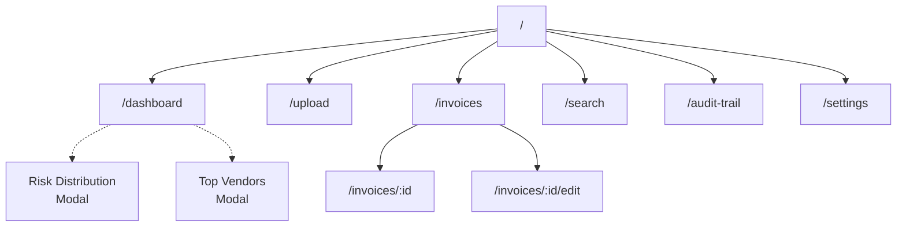

# Frontend Routes & Navigation
## AI-Powered Invoice Audit & Risk Screening Platform

**Version**: 1.0  
**Framework**: React Router v6  
**Date**: August 1, 2026

---

## Table of Contents
1. [Route Structure](#route-structure)
2. [Route Definitions](#route-definitions)
3. [Route Details](#route-details)
4. [Navigation Flow](#navigation-flow)

---

## Route Structure



---

## Route Definitions

### Root Configuration

```typescript
// src/App.tsx
import { BrowserRouter, Routes, Route } from 'react-router-dom'
import Layout from './components/layout/Layout'
import Dashboard from './pages/Dashboard'
import Upload from './pages/Upload'
import InvoiceList from './pages/InvoiceList'
import InvoiceDetail from './pages/InvoiceDetail'
import Search from './pages/Search'
import AuditTrail from './pages/AuditTrail'
import Settings from './pages/Settings'
import NotFound from './pages/NotFound'

export default function App() {
  return (
    <BrowserRouter>
      <Layout>
        <Routes>
          <Route path="/" element={<Dashboard />} />
          <Route path="/dashboard" element={<Dashboard />} />
          <Route path="/upload" element={<Upload />} />
          <Route path="/invoices" element={<InvoiceList />} />
          <Route path="/invoices/:id" element={<InvoiceDetail />} />
          <Route path="/invoices/:id/edit" element={<InvoiceDetail mode="edit" />} />
          <Route path="/search" element={<Search />} />
          <Route path="/audit-trail" element={<AuditTrail />} />
          <Route path="/settings" element={<Settings />} />
          <Route path="*" element={<NotFound />} />
        </Routes>
      </Layout>
    </BrowserRouter>
  )
}
```

---

## Route Details

### 1. Dashboard Route

**Path**: `/` or `/dashboard`

**Purpose**: Main landing page with overview

**Components**:
- Header (logo, navigation)
- Sidebar (navigation menu)
- SummaryCards (total invoices, amounts, high-risk count)
- RiskDistributionChart (pie chart)
- VendorStatsChart (bar chart)
- RecentInvoicesTable (last 10 uploads)
- ExceptionAlerts (flagged items)
- Footer

**API Calls**:
```typescript
GET /api/v1/dashboard/summary
GET /api/v1/dashboard/risk-distribution
GET /api/v1/dashboard/vendor-stats
GET /api/v1/dashboard/recent-uploads
```

**State Management**:
```typescript
const [dashboardData, setDashboardData] = useState<DashboardStats>()
const [loading, setLoading] = useState(true)
const [autoRefresh, setAutoRefresh] = useState(true)
```

**Features**:
- Auto-refresh every 30 seconds
- Click summary cards to filter invoices
- Click chart items to drill-down
- Modal dialogs for detailed views
- Print functionality

**Responsive Behavior**:
- Desktop: 3-column grid for cards, full charts
- Tablet: 2-column grid, responsive charts
- Mobile: 1-column, compact charts

**Loading State**:
- Skeleton screens for cards
- Chart placeholders
- Table loading animation

**Error State**:
- Retry button for failed loads
- Error message display
- Fallback to cached data (if available)

---

### 2. Upload Route

**Path**: `/upload`

**Purpose**: Invoice file upload interface

**Components**:
- DropZone (drag-and-drop area)
- FileInput (file picker)
- UploadProgress (progress bar)
- FilePreview (thumbnail/preview)
- UploadStatus (success/error messages)
- RecentUploads (history of uploads)

**API Calls**:
```typescript
POST /api/v1/upload (file upload)
GET /api/v1/upload/{id} (status check)
```

**State Management**:
```typescript
const [selectedFile, setSelectedFile] = useState<File | null>()
const [uploading, setUploading] = useState(false)
const [progress, setProgress] = useState(0)
const [uploadHistory, setUploadHistory] = useState<Upload[]>()
```

**Features**:
- Drag-and-drop support
- File picker
- Real-time progress bar
- File validation (type, size)
- Success notification → redirect to invoice detail
- Error messages with suggestions
- Upload history with status

**Validation Rules**:
```typescript
const ALLOWED_TYPES = ['application/pdf', 'image/jpeg', 'image/png']
const MAX_FILE_SIZE = 10 * 1024 * 1024 // 10MB
```

**User Actions**:
- Upload file → API call → polling for status
- On success → redirect to invoice detail page
- On error → show error message + retry option
- View upload history → filter/search

---

### 3. Invoice List Route

**Path**: `/invoices`

**Purpose**: Searchable, filterable invoice table

**Components**:
- SearchBar (text search)
- FilterPanel (advanced filters)
- InvoiceTable (sortable table)
- Pagination (page controls)
- BulkActions (select multiple, export)
- ExportButton (CSV/PDF export)

**Query Parameters**:
```typescript
?page=1&limit=25&status=PROCESSED&risk_level=HIGH&vendor=ABC
```

**API Calls**:
```typescript
GET /api/v1/invoices?page={page}&limit={limit}&filters={filters}
GET /api/v1/invoices/{id} (on row click)
```

**State Management**:
```typescript
const [invoices, setInvoices] = useState<Invoice[]>()
const [filters, setFilters] = useState<FilterState>()
const [sorting, setSorting] = useState<SortState>()
const [pagination, setPagination] = useState<PaginationState>()
const [selected, setSelected] = useState<Set<string>>()
```

**Filter Options**:
- Status (PENDING, PROCESSED, FLAGGED, APPROVED, REJECTED)
- Risk Level (LOW, MEDIUM, HIGH, CRITICAL)
- Date Range (custom date picker)
- Vendor (multi-select dropdown)
- Amount Range (min-max inputs)

**Sorting Options**:
- Invoice Number
- Vendor Name
- Invoice Date
- Total Amount
- Risk Score
- Upload Date
- Status

**Table Columns**:
| Column | Type | Sortable | Filterable |
|--------|------|----------|-----------|
| Checkbox | Select | - | - |
| Invoice # | Text | ✓ | - |
| Vendor | Text | ✓ | ✓ |
| Date | Date | ✓ | ✓ |
| Amount | Currency | ✓ | ✓ |
| Risk | Badge | ✓ | ✓ |
| Status | Badge | ✓ | ✓ |
| Actions | Buttons | - | - |

**Row Actions**:
- View (→ Invoice Detail)
- Edit (→ Edit mode)
- Delete (with confirmation)
- Flag/Unflag
- Export

**Pagination**:
- Page indicators
- Items per page selector (25/50/100)
- First/Last/Next/Prev buttons
- Jump to page input

**Search Features**:
- Real-time search (debounced 300ms)
- Search across: invoice #, vendor, amount
- Search suggestions/autocomplete

---

### 4. Invoice Detail Route

**Path**: `/invoices/:id`

**Purpose**: Detailed view of single invoice

**Components**:
- Breadcrumb (Dashboard > Invoices > INV-001)
- InvoiceHeader (invoice number, status, dates)
- ExtractedDataPanel (all extracted fields)
- MatchingPanel (ledger & vendor matching details)
- RiskAnalysisPanel (risk score, factors, explanation)
- ExceptionsList (validation failures)
- AuditTrailPanel (action history)
- FilePreview (PDF/image viewer)
- ActionButtons (approve, reject, flag, edit)

**API Calls**:
```typescript
GET /api/v1/invoices/{id} (full details)
GET /api/v1/audit/trail/{id} (audit trail)
PATCH /api/v1/invoices/{id} (manual edits)
```

**State Management**:
```typescript
const [invoice, setInvoice] = useState<Invoice>()
const [editMode, setEditMode] = useState(false)
const [unsavedChanges, setUnsavedChanges] = useState<Partial<Invoice>>()
const [auditTrail, setAuditTrail] = useState<AuditEntry[]>()
```

**Tabs**:
1. **Overview**: Extracted data + matching
2. **Risk Analysis**: Risk score, factors, rules
3. **Exceptions**: Validation failures
4. **Audit Trail**: Action history
5. **File**: PDF/image preview

**Edit Mode**:
- Allow editing extracted fields
- Show validation errors
- Compare before/after values
- Recalculate risk on change
- Save changes → API call

**File Preview**:
- PDF viewer (react-pdf)
- Image zoom/pan
- Highlight extracted regions
- Page navigation

---

### 5. Search Route

**Path**: `/search`

**Purpose**: Advanced search interface

**Components**:
- AdvancedSearchForm (complex filters)
- SearchResults (result table)
- SavedSearches (bookmark searches)
- SearchHistory (recent searches)

**Features**:
- Natural language search
- Advanced filter builder
- Save searches for reuse
- Export search results
- Search history with timestamps

---

### 6. Audit Trail Route

**Path**: `/audit-trail`

**Purpose**: System-wide audit log

**Components**:
- TimelineView (vertical timeline)
- FilterPanel (action, date, actor)
- DetailPanel (expanded entry details)
- ExportButton

**API Calls**:
```typescript
GET /api/v1/audit/trail (global audit log)
```

---

### 7. Settings Route

**Path**: `/settings`

**Purpose**: Application settings (future)

**Components**:
- GeneralSettings
- NotificationSettings
- DisplaySettings
- ExportSettings

---

## Navigation Flow

### User Journey: Upload New Invoice

```
User → /upload
  ↓ Select file
  ↓ API: POST /upload
  ↓ Polling GET /upload/{id}
  ↓ Processing complete
  → Auto-redirect to /invoices/{id}
  ↓ User views extracted data
  ↓ Reviews risk analysis
  ↓ Approves or flags
  → Back to /invoices (list view)
```

### User Journey: Search High-Risk Invoices

```
User → /invoices (list view)
  ↓ Apply filter: risk=HIGH
  ↓ API: GET /invoices?filters={risk:HIGH}
  ↓ Results displayed
  ↓ Click row to view
  → /invoices/{id} (detail view)
  ↓ View risk factors
  ↓ Check matching details
  ↓ Audit trail
  ↓ Approve/Reject
  → Back to /invoices
```

### User Journey: Dashboard Overview

```
User → / (dashboard)
  ↓ Auto-load summary data
  ↓ Charts with data
  ↓ Click HIGH risk card
  → /invoices?filter={risk:HIGH}
  ↓ Filtered list displayed
```

---

## Breadcrumb Navigation

### Examples

```
Dashboard Home
Dashboard > Invoices
Dashboard > Invoices > INV-2024-001
Dashboard > Upload
Dashboard > Search
Dashboard > Audit Trail
Dashboard > Settings
```

---

## Mobile Navigation

### Responsive Changes

**Desktop** (>1024px):
- Sidebar navigation (always visible)
- Full table columns
- Multiple panels side-by-side

**Tablet** (768-1024px):
- Hamburger menu + sidebar
- Reduced table columns
- Stacked panels with tabs

**Mobile** (<768px):
- Bottom navigation bar
- Hamburger menu for routes
- Single column layout
- Expandable sections

### Bottom Navigation (Mobile)

```
[🏠 Home] [📤 Upload] [🔍 Search] [☰ Menu]
```

---

## Protected Routes (Future)

```typescript
// Once auth is implemented:
<PrivateRoute>
  <Route path="/dashboard" element={<Dashboard />} />
  <Route path="/invoices" element={<InvoiceList />} />
</PrivateRoute>

// Public routes:
<Route path="/login" element={<Login />} />
<Route path="/signup" element={<Signup />} />
```

---

**Version**: 1.0  
**Last Updated**: August 1, 2026

---

**END OF ROUTES DOCUMENT**
